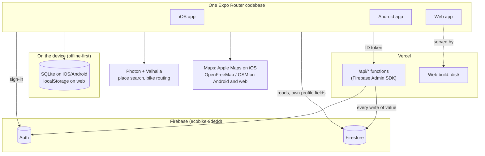
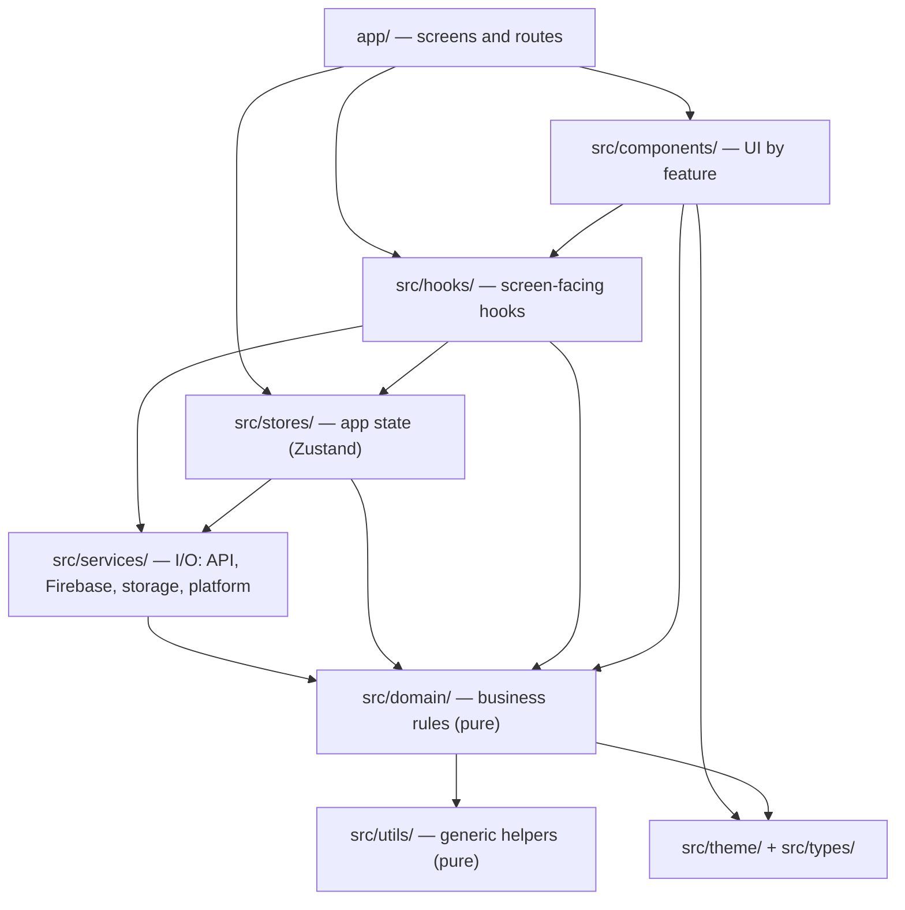
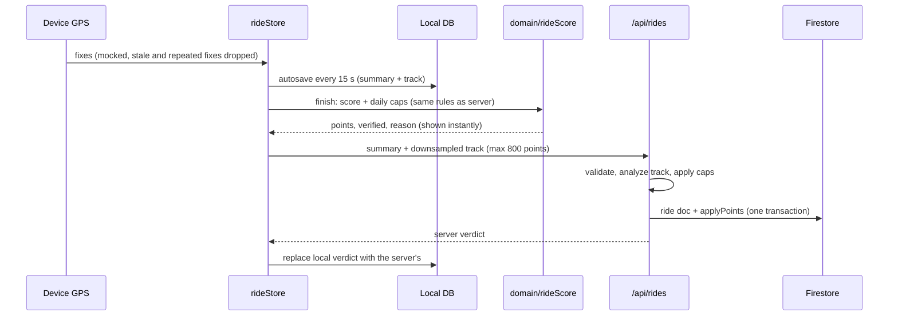
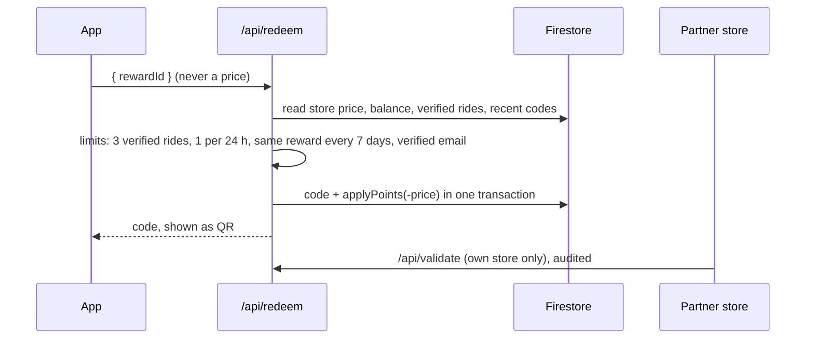

# EcoBike

Cycling app for Pasto and Nariño, Colombia. Riders record rides with GPS, earn points only for verified bike rides, keep a daily streak, complete random daily missions, compete in a weekly league with friends, plan greener bike routes (Eco ruta) and redeem points for rewards at partner stores. Partner stores validate redemption codes by QR. An administrator panel manages stores, users, points and roles.

One codebase ships the iOS app, the Android app and the web app, against one Firebase project and one API. The app content is in Spanish. This document is in English.

**Contents:**
1. [Architecture at a glance](#architecture-at-a-glance)
2. [Layers and dependency rules](#layers-and-dependency-rules)
3. [Key flows](#key-flows)
4. [Repository layout](#repository-layout)
5. [Where new code goes](#where-new-code-goes)
6. [Features](#features)
7. [Stack](#stack)
8. [Ride verification and economy](#ride-verification-and-economy)
9. [Security](#security)
10. [Quality](#quality)
11. [Decisions and tradeoffs](#decisions-and-tradeoffs)
12. [Security model](#security-model)
13. [Local setup](#local-setup)
14. [Environment variables](#environment-variables)
15. [Deployment](#deployment)
16. [Known limitations and next steps](#known-limitations-and-next-steps)
17. [Documentation](#documentation)

## Architecture at a glance

The paradigm is **local-first client, authoritative server for value**:

- **The device** records and shows everything offline: rides, stats, streaks, missions.
- **The server** (`api/*.js` on Vercel, Firebase Admin SDK) is the only writer of anything with value: points, roles, redemption codes, the store catalog and the public profile.
- **Back to the device:** the server's verdict replaces whatever the device computed.



| Piece | Where | Responsibility |
| --- | --- | --- |
| App (iOS, Android, web) | `app/`, `src/` | UI, offline recording, local stats, sync |
| API | `api/` on Vercel | Points, rides, redemptions, roles, stores, admin, friends, chat, account deletion, export |
| Database | Firestore | Shared data for all platforms; client writes limited by `firebase/firestore.rules` |
| Images | Firestore (inline data URLs) | Avatars (160 px JPEG on the profile), store logos (256 px WebP on the store). Cloud Storage needs the paid Blaze plan since Feb 2026, so the app doesn't use it |
| Maps and routing | Apple Maps (iOS), MapLibre + OpenFreeMap (Android), Leaflet + OSM (web), Photon, Valhalla | Map display, place search, bicycle routes; all free, no API keys |

The 15 architecture rules every change must follow are in [docs/architecture/spine.md](docs/architecture/spine.md). Each rule states what it binds and the divergence it prevents.

## Layers and dependency rules

The client is split into layers. A layer may only depend on the layers below it, never above.



| Layer | Folder | Holds | May import | Must not |
| --- | --- | --- | --- | --- |
| Routes | `app/` | One file per screen (Expo Router) | Everything below | Talk to Firebase or `/api` directly |
| Components | `src/components/` | Reusable UI grouped by feature | hooks, stores (read), domain, utils, theme | Write data; call services that write |
| Hooks | `src/hooks/` | Screen-facing data hooks (`useRiderStats`, `useRewards`) | stores, services, domain | Render UI |
| State | `src/stores/` | Zustand stores (auth, ride tracking, settings) | services, domain | Import components |
| Services | `src/services/` | All I/O: `/api` client, Firebase, local DB, key-value storage, platform features | domain, utils, Firebase SDK | Import React components or stores |
| Domain | `src/domain/` | Business rules as pure functions: scoring, verification, streaks, missions, navigation | utils, types | Do I/O, import React, read the clock implicitly where a parameter can be passed |
| Utils | `src/utils/` | Generic pure helpers: formatting, geometry, polyline decoding | types | Know about EcoBike rules |
| Server | `api/` | Vercel functions; `_lib.js` shared helpers | firebase-admin | Be imported by the client |

Two rules matter more than the rest:

- **Value is decided on the server.** Points move only through `applyPoints` in `api/_lib.js`, and a test fails if any handler writes a balance directly.
- **Scoring rules exist twice, on purpose.** `src/domain/rideScore.ts` gives an instant offline result; `api/_lib.js` is authoritative. `src/domain/__tests__/scoreParity.test.ts` keeps them identical.

Platform differences live in **paired files with the same exported API**, never in `if (Platform.OS)` branches inside services. Metro picks the file per platform, and `tsconfig.json` `moduleSuffixes` makes TypeScript check the same thing.

| Pair | Native | Web |
| --- | --- | --- |
| `services/db` | SQLite with in-place migrations | localStorage, one key per GPS track |
| `services/kv` | SecureStore (keychain/keystore) | localStorage |
| `services/connectivity` | NetInfo | `navigator.onLine` |
| `services/push`, `services/reminders` | expo-notifications | no-ops |
| `components/map/RideMap` | iOS: Apple Maps (`.native.tsx`); Android: MapLibre + OpenFreeMap (`.android.tsx`) | Leaflet + OpenStreetMap |

## Key flows

**A ride, from GPS to points:**



**A redemption:**



## Repository layout

```
.
├── app/                        Screens (Expo Router, file-based routes)
│   ├── (auth)/                   Welcome, login, register, forgot password
│   ├── (tabs)/                   Inicio, Mapa, Progreso, Premios, Amigos, Perfil
│   ├── settings/                 Settings, edit profile, help, maintenance, delete account
│   │   └── admin/                  Admin dashboard, store editor, user detail
│   ├── ride/[id].tsx             Ride detail (map, profile, splits, verdict)
│   └── chat/, friend/, points/, legal/, history.tsx, onboarding.tsx
│
├── src/
│   ├── components/             UI, grouped by feature
│   │   ├── ui/                   Design system: Liquid Glass primitives, tab bar, large titles, motion
│   │   ├── app-shell/            Error boundary, biometric lock, web shell, email-verify banner
│   │   ├── map/                  RideMap (.android MapLibre, .native Apple Maps, .web Leaflet), launcher, Eco ruta, navigation
│   │   ├── ride/                 Ride-complete celebration
│   │   ├── rewards/              Catalog, carousel, redeem sheet, hold-to-confirm, store logos
│   │   ├── gamification/         Streak and daily missions cards
│   │   ├── admin/                Admin guard, QR scanner for code validation
│   │   ├── auth/                 Auth screen scaffold
│   │   └── charts/               Area, bar and donut charts
│   ├── domain/                 Business rules, pure and tested
│   │   ├── rideScore.ts          Bike detection, points, daily caps (mirrors api/_lib.js)
│   │   ├── verified.ts           The one definition of a verified ride
│   │   ├── gamification.ts       Rider stats, levels, achievements
│   │   ├── missions.ts, streak.ts, week.ts, rideGoals.ts
│   │   ├── navigation.ts         Turn-by-turn: next maneuver, off-route, arrival
│   │   ├── rideStats.ts, rideAnalysis.ts, maintenance.ts, autoPause.ts
│   │   ├── rewardsMapping.ts, profileForm.ts
│   │   └── __tests__/            Unit and client/server parity tests
│   ├── services/               All I/O
│   │   ├── api.ts                Authenticated client for /api
│   │   ├── firebase.ts, auth.service.ts, rides.service.ts, rewards.service.ts,
│   │   │   social.service.ts, chat.service.ts, account.service.ts, admin.service.ts
│   │   ├── routing.ts            Photon search and Valhalla routing (only place that calls them)
│   │   ├── db.native.ts / db.web.ts, kv.ts / kv.web.ts, connectivity.ts / .web.ts,
│   │   │   push.ts / .web.ts, reminders.ts / .web.ts
│   │   ├── e2e.ts                Test-only session, compiled in only for the e2e build
│   │   └── __tests__/            Web storage contract, search ranking
│   ├── stores/                 Zustand: authStore, rideStore (GPS state machine), settingsStore...
│   ├── hooks/                  useRiderStats, useAvailablePoints, useRewards, useLayout...
│   ├── utils/                  Generic helpers: format, geo, polyline, chart math, share text
│   ├── theme/                  Colors, typography, motion tokens, glass
│   └── types/                  Domain types (Ride, Reward, UserProfile, Achievement)
│
├── api/                        Vercel functions (11 of the 12 allowed on Hobby)
│   ├── rides.js, redeem.js, users.js, stores.js, validate.js, friends.js,
│   │   me.js, messages.js, export.js, sessions.js, account.js
│   ├── _lib.js                   Auth, scoring, caps, applyPoints, projectPublic, rateLimit, audit
│   └── _fake-admin.cjs, _*.test.mjs   In-memory Firebase Admin and handler tests (not deployed)
│
├── firebase/                   Firestore rules and indexes, Storage rules, rules tests (emulator)
├── e2e/                        Playwright: smoke.spec.ts (prod build), flows.spec.ts (test build)
├── docs/                       Architecture spine, review, database, security, deployment, development
├── scripts/                    serve-dist, e2e build, icon generation, test alias loader
├── assets/                     App icons, logo, splash; store-logos/ for the admin panel
│
├── app.config.ts               Expo config (plugins, permissions, bundle ids)
├── eas.json                    EAS build profiles (development, preview, production)
├── vercel.json                 Web build, SPA rewrites, security headers
├── firebase.json               Points the Firebase CLI to firebase/
├── eslint.config.js            ESLint (eslint-config-expo) with documented exceptions
├── playwright.config.ts        Two servers: production build and test build
└── .github/workflows/ci.yml    Typecheck, lint, tests, builds, rules emulator, e2e
```

Files starting with `_` in `api/` are not deployed as functions. `android/` and `ios/` are generated by `expo prebuild` and never committed.

## Where new code goes

| You are adding | Put it in | Remember |
| --- | --- | --- |
| A screen | `app/` (route file) | Use `LargeTitleScreen`; read data through hooks |
| A business rule (scoring, limits, streaks) | `src/domain/` + a test in `src/domain/__tests__/` | If the server enforces it too, change `api/_lib.js` in the same commit and extend the parity test |
| Anything that reads or writes data | `src/services/` | Values (points, roles, codes) are written through `/api`, never from the client |
| A platform-specific capability | `src/services/name.ts` + `name.web.ts` | Same exported API in both |
| A server endpoint | An action of an existing `api/*.js` handler | Each new file costs one of the 12 Vercel functions; audit admin writes with `logAdmin` |
| A new Firestore collection keyed by user | `firebase/firestore.rules` (default deny) | Add it to `deleteUserData` and `api/export.js` |
| A reusable UI piece | `src/components/<feature>/` or `ui/` if generic | Lime `#7BF510` only for functional state; motion tokens from `theme/motion.ts` |
| Copy that states a rule (points per km, caps) | Import the constant from `src/domain/rideScore.ts` | Never type numbers into text |

## Features

| Area | What it does |
| --- | --- |
| Inicio | Greeting, weekly goal, points badge, daily missions, streak, next reward, last ride, CO₂ saved |
| Map | Full-screen map with one round EcoBike button that opens three ride modes. **Libre:** free ride. **Eco ruta:** search a place near you, get a greener bike route that avoids unpaved roads, preview alternatives, then follow it turn by turn with off-route detection and recalculation. **Entrenamiento:** your own km or time goal. Also: heading arrow on web, locate button, background tracking, auto-pause, keep-screen-on |
| Ride verification | Server-side bike detection on a downsampled GPS track (speed profile, GPS jumps, distance cap), daily caps, reason shown when a ride earns nothing |
| Gamification | Verified-only achievements, current and best streak, three random daily missions per user and day, levels, weekly league |
| Progreso | Period comparison, trend, habits, environmental impact, heatmap, records, achievements |
| Premios | Search with a "can redeem" chip, 3D coverflow carousel with company logos as stamps, "how it works" sheet, press-and-hold redemption, QR code, my codes |
| Amigos | Exact-username search, requests, 1:1 chat with push, friend profiles, weekly and total ranking |
| Administración | KPIs; store CRUD with logo upload; user search, detail, role (partner with store), points adjustment with a written reason, suspend, rename, delete; audit history; code validation for partners |
| Perfil and Ajustes | Edit profile, notifications, privacy ("hide me from search"), biometric unlock, sign out everywhere, data export, resync, bike maintenance, help, legal |
| Onboarding and guest mode | Goal personalization for new accounts; guest mode with realistic example data |

## Stack

### Languages

| Language | Where |
| --- | --- |
| TypeScript (strict) | App code, services, stores, domain rules, tests |
| TSX | Screens and components |
| JavaScript (CommonJS) | Vercel functions in `api/` |
| Firebase rules language | `firebase/firestore.rules`, `firebase/storage.rules` |

### Client

| Technology | Use | Reason |
| --- | --- | --- |
| Expo SDK 57 (`expo` ~57.0.26) | Build system, native modules, app config | One toolchain for iOS, Android and web; EAS builds |
| React Native 0.86.3, React 19.2.3 | UI runtime | Native rendering on phones |
| React Native Web 0.21 | Web rendering of the same components | The web is the same app, not a separate site |
| Expo Router 57 | File-based routing, typed routes, protected route groups (`Stack.Protected`), tabs | Deep links and auth gating without manual navigation setup |
| Reanimated 4.5 + worklets | Motion on the UI thread: springs, scroll-linked large titles, carousel, hold-to-confirm | Fluid motion without JS-thread jank |
| react-native-gesture-handler | Map sheet drag, swipe rows | Native gesture recognition |
| expo-blur, expo-linear-gradient | Liquid Glass surfaces (iOS 26 style) | Native blur and gradients, CSS backdrop-filter on web |
| react-native-svg | Charts, rings, launcher light trace | Vector drawing on every platform |
| Zustand 5 | `authStore`, `rideStore`, `settingsStore` | Small stores; works with the GPS callback outside React |
| date-fns 4 | Dates in Spanish | Tree-shakable date formatting |
| expo-haptics | Tactile feedback | Native haptics; skipped on web until the user interacts |
| react-native-qrcode-svg | Redemption QR codes | Pure SVG, works on web too |
| expo-camera | QR scanner for partner validation | One scanner component for iOS, Android and web |
| expo-image-picker | Avatars and store logos | Same API on every platform |
| expo-secure-store | Settings, local profile, guest id (native) | OS keychain/keystore behind `services/kv` |
| expo-local-authentication | Biometric unlock of an existing session | Local unlock only, never identity |
| expo-notifications | Push and weekly reminders | Native only (web gets no-op stubs) |
| @sentry/react-native | Client error reporting | Crash and error visibility with request ids |

### Maps, location and routing

| Technology | Use | Reason |
| --- | --- | --- |
| expo-location + expo-task-manager | Foreground and background GPS, mocked-location filter | Rides keep recording with the screen off |
| expo-maps (alpha) | Apple Maps on iOS, parks and transit only | First-party, free, no key on iOS |
| MapLibre React Native 11 + OpenFreeMap | Android map: Positron vector style, glowing route, heading arrow | Free for commercial use, no API key, no request limits (attribution shown); same look and markers as web |
| Leaflet 1.9 + react-leaflet 5 | Web map with OSM tiles, rider arrow (or dot without heading), glowing route | expo-maps has no web target; OSM needs no key |
| Photon (komoot) | Place search, ranked by distance to the rider | Free OSM geocoder; position coarsened to about 100 m |
| Valhalla (FOSSGIS) | Bicycle routing with `avoid_bad_surfaces`, `use_roads`, alternates, Spanish instructions | Free OSM router that understands unpaved surfaces |

### Data

| Technology | Use | Reason |
| --- | --- | --- |
| Firestore | `usuarios`, `usuarios_public`, `usernames`, `tiendas`, rides and redemption codes under each user, `chats`/`messages`, `admin_logs`, `rate_limits` | One database for all platforms |
| Images in Firestore | `usuarios/{uid}.profileImageUrl`, `tiendas/{id}.logo` as data URLs | Free on the Spark plan; images arrive with their document |
| Firebase Auth | Email/password, Google, Apple; revocable sessions | Managed identity |
| expo-sqlite | Local rides (summaries and tracks), achievements, redemptions on iOS/Android | Offline-first storage with in-place migrations |
| localStorage | Same API on web, one key per GPS track, in-memory summary cache | No SQLite on web |
| Firebase JS SDK 12.19 / firebase-admin 13 | Client reads and profile writes / every write of value, in transactions | One SDK per side |

Collections, rules and endpoints: [docs/database.md](docs/database.md).

### Server, cloud and tooling

| Service or tool | Use | Reason |
| --- | --- | --- |
| Vercel (Node 24) | Web hosting and 11 serverless functions in `api/` | Same origin for web, one deploy; no Firebase Cloud Functions plan needed |
| Firebase (Auth, Firestore, Storage) | Identity and data | Managed, with security rules |
| Sentry (`@sentry/node`) | Server error reporting with request ids | Errors traceable from a user report |
| EAS Build | iOS and Android binaries | Cloud builds for both stores |
| GitHub Actions | CI on every push and pull request | Nothing merges red |
| ESLint (eslint-config-expo), TypeScript strict | Static checks | Consistent code, caught mistakes before review |
| node:test, Playwright, Firebase emulator | Unit/API, end-to-end, rules tests | No extra test framework for unit tests |

## Ride verification and economy

| Rule | Value | Where |
| --- | --- | --- |
| Points per km | 5 | `src/domain/rideScore.ts` and `api/_lib.js` |
| Bonus per real ride | 5, only for 1 km or more and 5 minutes or more | both |
| Minimum distance | 500 m | both |
| Bike detection | At least 60% of moving time at 7–50 km/h | both |
| GPS jumps | Over 80 km/h between fixes counts as a jump; more than 200 m of jumps earns 0 | both |
| Credited distance | Never more than the track shows plus 10% | both |
| Average speed | Over 45 km/h is rejected | server |
| Daily caps | 150 points and 20 rides per rolling 24 h, server time | both (server decides) |
| Track | At most 800 samples, analyzed and discarded; fixes outside the ride window dropped; duplicate or out-of-order fixes skipped | both |
| First redemption | 3 verified rides and a verified email for password accounts | server |
| Redemption limits | 1 per 24 h; the same reward once every 7 days; price read from the store document | server |
| Fake GPS | Android mocked locations are ignored on the device | client |

A ride is **verified** when it passed bike detection, even if a cap left it at 0 points. Achievements, missions, streaks and the 3-ride redemption gate count verified rides only. Rides stored before verification existed don't count.

## Security

| Control | Implementation |
| --- | --- |
| Server-only value | Points, league, rides, codes, roles, `cuentaActiva`, friendships, usernames, chats, stores and audit logs are written only by `api/*.js`. `firestore.rules` defaults to deny |
| One path for points | `applyPoints` updates balance, public mirror and league together; a test fails if any handler writes these fields directly |
| Token checks | Every API call carries a Firebase ID token, verified with revocation checks |
| Admin authorization | `requireAdmin` / `isAdminUser` on the server; the client guard (`AdminOnly`) is only UX |
| Audit | Every admin or partner write goes to `admin_logs` (who, what, target, before/after, reason), including writes whose Auth step fails; deletion logs carry no personal data |
| Public profiles | `usuarios_public` is readable only by id (no list queries), so profiles can't be enumerated. Username search goes through `/api/friends` and honors "hide me". Friend lists are not public. The mirror is written through a validated projection (`projectPublic`) |
| Rate limits | `rate_limits/{uid}` (server-only): data export once every 10 minutes, friend requests every 5 seconds; chat 20 messages per minute; at most 100 pending friend requests |
| Admin safety | Points change only with a written reason and the balance the admin saw (stale edits get 409). An admin can't demote, suspend or delete themself. Demoting revokes old admin claims |
| Uploads | Images are resized on the device (expo-image-manipulator) and saved as data URLs. Avatars: owner only, JPEG data URL under 60 KB (Firestore rules). Store logos: admins only through `/api/stores`, PNG/JPG/WebP under 200 KB, required for new stores |
| Store deletion | Refused while partners are assigned or customers hold unused codes |
| Personal data | Emails travel in request bodies, never URLs or logs. Signing out on web uploads pending rides, then clears local GPS history |
| Secrets | `EXPO_PUBLIC_*` values are public client config. The service account key and the server Sentry DSN exist only as Vercel environment variables |
| Test session | The Playwright session exists only in the `dist-e2e` build (`EXPO_PUBLIC_E2E=1`); builds use `--clear` so it never leaks into production, and it can't pass server token checks |

Full endpoint list and privacy model: [docs/security.md](docs/security.md).

## Quality

| Practice | State |
| --- | --- |
| Type checking | `npm run typecheck` (TypeScript strict) |
| Linting | `npm run lint` (ESLint, eslint-config-expo); 0 errors, exceptions documented in `eslint.config.js` |
| Unit and API tests | 172 tests with `node:test` (`npm test`): domain rules, parity, web storage contract, and the real `api/*.js` handlers end to end on an in-memory Firebase Admin |
| Parity tests | Device and server give the same score, caps and league week for the same input |
| Rules tests | `firebase/firestore.rules.test.mjs` on the Firestore emulator (CI; locally needs Java) |
| End-to-end tests | Playwright, phone and desktop, 22 tests: a guest tour on the production build, plus admin panel, real redemption and Eco ruta on the test build with every external service mocked |
| Native check | Release build run on an Android emulator; a crash only visible on native (a worklet copying a React ref) was found and fixed this way |
| Continuous integration | `.github/workflows/ci.yml`: typecheck, lint, unit tests, web build, iOS and Android bundles, `expo-doctor`, rules emulator, both web builds and Playwright |
| Code review | Independent review passes (adversarial, edge cases, verification gaps, intent alignment), findings triaged before merge |
| Monitoring | Sentry on client and server; every API response carries `X-Request-Id` |
| History | One line ending (LF, `.gitattributes`); formatting-only commits listed in `.git-blame-ignore-revs` |
| Accessibility | Labels and roles, screen-reader alternative to press-and-hold, VoiceOver announcements for turns, reduced-motion support, Android back closes overlays |

### AI-assisted engineering

| Tool | Use |
| --- | --- |
| Claude Code | Codebase analysis, implementation, verification in the browser, terminal and Android emulator |
| BMad Method | Code review (adversarial, edge-case, verification-gap and intent lenses as independent agents), architecture spine with a reviewer gate, generated API and end-to-end tests |

Agents draft plans and code. Changes are verified with typecheck, lint, tests, the browser and the emulator before commit, and reviewed by a person before production.

## Decisions and tradeoffs

| Decision | Alternative considered | Gain | Cost |
| --- | --- | --- | --- |
| One Expo Router codebase for iOS, Android and web | Separate web app (Next.js) and native apps | One set of screens, rules and tests; features ship everywhere at once | Web bundle is large (about 6.7 MB); native-only features (push, native map arrow) differ on web; native-only bugs need a native run to find |
| Local-first storage (SQLite / localStorage) | Online-only Firestore reads | Rides record and display with no network; instant stats | Two copies of ride data to reconcile; sync logic and tests needed |
| Server is the only writer of value (Vercel + Admin SDK) | Client writes guarded by Firestore rules only | Prices, points and limits can't be faked; caps and transactions in code | Every value action needs the API; 12-function limit on Vercel Hobby (11 used) |
| Vercel functions instead of Firebase Cloud Functions | Cloud Functions (needs the Blaze plan) | Same deploy as the web; no paid Firebase plan | Two platforms to operate; Hobby is non-commercial and has a function cap |
| `src/domain/` separate from `src/utils/` | One utils folder | Business rules are easy to find, review and test; helpers stay generic | One more folder to choose from (see "Where new code goes") |
| Scoring rules on device and server, held by a parity test | Server-only scoring | Finish screen shows the real result offline | Two copies to change together |
| Bike detection by speed profile of a downsampled track | Device attestation (App Check, Play Integrity) or sensor fusion | No extra native module; works on web | A modified client can fabricate a plausible track; App Check is the next step |
| Verified flag stored by the server | Deriving "verified" from points > 0 | Capped rides still count; rejected and legacy rides don't | One more field to migrate locally |
| Ride summaries stored apart from GPS tracks | One record with the whole track | Lists and stats never parse tracks; web survives a full quota | Callers must load the full ride (`getRide`) before saving |
| Incremental remote pull (last week) | Full history download on each start | Fewer reads and faster start | A ride deleted on another device stays until server reconciliation exists |
| Public profile readable only by id; search through the API | Client list queries on `usuarios_public` | Profiles can't be enumerated; "hide me" is enforced | One function call per search; old app versions can't search until updated |
| Per-user rate limits in a Firestore collection | Redis, Vercel KV or firewall rules | No new service; atomic in a transaction | One extra read and write per limited call |
| Logos and avatars as small data URLs in Firestore | Cloud Storage files | No paid plan (Storage requires Blaze since Feb 2026); no orphan files; one write path | Every read of the document carries the image; images must stay tiny (256 px) |
| Apple Maps on iOS, MapLibre + OpenFreeMap on Android, Leaflet on web | Google Maps on Android (expo-maps), react-native-maps everywhere | No API keys or billing accounts anywhere; Android and web share OSM data, style and the heading arrow | Three map implementations behind one contract (`RideMap.types.ts`); expo-maps on iOS is alpha |
| Free Photon and Valhalla servers | Paid geocoding/routing or self-hosting | No keys, no cost, understands unpaved roads | No SLA; fair-use limits |
| Paired platform files (`name.ts` / `name.web.ts`) | `Platform.OS` branches in services | Web never imports native-only modules | Two files to keep in sync per service |
| Press-and-hold to redeem | Two-step confirmation dialog | One deliberate gesture, less text | Needs a screen-reader alternative (provided) |
| Lime #7BF510 only for functional state, motion over color | Green accents everywhere | Calm, legible UI | Categories no longer differ by color |

## Security model

| Actor | Can do | Mechanism |
| --- | --- | --- |
| Guest | Use the app with demo data stored on the device | No account; demo points and codes never reach the server |
| Rider (signed in) | Record rides; earn server-awarded points; redeem; chat with friends; edit own name, photo and search visibility; export or delete own data | ID token on every API call; rules allow only own allowlisted fields |
| Partner | Validate codes of its own store only | `role: partner` + `storeId`, checked in `api/validate.js`; every confirmation audited |
| Administrator | Manage stores, users, roles, points (with reason) and suspensions; upload store logos | `role: admin` (or legacy `isAdmin` / `admin` claim), checked on the server for every call; audited |
| Firebase client SDK | Read the catalog, own private data and other public profiles by id | `firebase/firestore.rules`, default deny |
| Server (Admin SDK) | Full access | Only in `api/*.js` on Vercel, with the service account in an environment variable |

## Local setup

Requirements:
- Node.js 22 or later, and npm.
- Java 21, only for the rules emulator tests.
- Android Studio (SDK, emulator) or Xcode, only for native builds.
- A Firebase project for real accounts. Without one, the app runs in demo mode.

```bash
npm install
```

```bash
npx expo start
```

Press `w` for web. iOS and Android need a development build, because the app uses native modules Expo Go doesn't include ([docs/development.md](docs/development.md)). To enable accounts and sync, copy `.env.example` to `.env` and fill in the Firebase values ([docs/environment.md](docs/environment.md)).

| Command | Purpose |
| --- | --- |
| `npm start` | Expo dev server |
| `npm run ios` / `npm run android` | Native development builds |
| `npm run web` | Web dev server |
| `npm run typecheck` | TypeScript check |
| `npm run lint` | ESLint |
| `npm test` | Unit, parity, storage and API handler tests |
| `npm run test:rules` | Firestore rules on the emulator (needs Java) |
| `npm run build:web` | Production web build to `dist/` (clean cache) |
| `npm run build:web:e2e` | Test build with the e2e session to `dist-e2e/` (never deployed) |
| `npm run test:e2e` | Playwright against both builds (run both builds first) |
| `npm run deploy:rules` | Firestore rules and indexes to `ecobike-9dedd` |
| `node scripts/seed-stores.mjs <key.json> [--apply]` | Replace the partner catalog in Firestore with `src/data/stores.json` (dry run without `--apply`) |

## Environment variables

| Variable | Scope | Purpose |
| --- | --- | --- |
| `EXPO_PUBLIC_FIREBASE_*` (API key, auth domain, project id, storage bucket, sender id, app id) | Client (public) | Firebase web config |
| `EXPO_PUBLIC_GOOGLE_IOS_CLIENT_ID`, `_ANDROID_`, `_WEB_` | Client (public) | Google Sign-In |
| `EXPO_PUBLIC_API_URL` | Client (public) | Vercel deployment URL for native apps (web uses same origin) |
| `EXPO_PUBLIC_SENTRY_DSN`, `EXPO_PUBLIC_SUPPORT_EMAIL`, `EXPO_PUBLIC_APP_ENV` | Client (public) | Monitoring, support contact, environment label |
| `FIREBASE_SERVICE_ACCOUNT_KEY` | Server (Vercel) | Admin SDK credentials (JSON) |
| `FIREBASE_STORAGE_BUCKET` | Server (Vercel, optional) | Bucket for deletions and logos |
| `SENTRY_DSN` | Server (Vercel, optional) | Server error reporting |
| `SENTRY_DISABLE_AUTO_UPLOAD` | Local release builds | Skips source-map upload when no Sentry organization is configured |
| `EXPO_PUBLIC_E2E` | Test build only | Enables the Playwright session; never set for real builds |

Anything secret must never use the `EXPO_PUBLIC_` prefix: those values are embedded in the app bundle.

## Deployment

Order matters, because rules must never require something the deployed API doesn't do yet:

1. **API and web:**
   ```bash
   vercel deploy --prod
   ```
   Production needs `FIREBASE_SERVICE_ACCOUNT_KEY`. Preview deployments have no server credentials.
2. **Rules and indexes**, after the API is live:
   ```bash
   npm run deploy:rules
   ```
   New composite indexes take a few minutes to build.
3. **Mobile apps:**
   ```bash
   eas build --profile production --platform all
   ```

Keep `api/` at 12 functions or fewer on Vercel Hobby. Details: [docs/deployment.md](docs/deployment.md).

## Known limitations and next steps

- **iOS rider arrow:** Android and web draw a heading arrow; iOS shows Apple's system location marker (which also shows heading). Moving iOS to MapLibre would make all three identical.
- **Device attestation:** App Check on `/api/rides` would stop fabricated tracks. It needs a native module, since the Firebase JS SDK providers are web-only.
- **Web bundle size:** a large shared chunk (about 5.2 MB) needs a dependency audit before route splitting pays off.
- **Rules allowlist:** the `usuarios` update rule uses a denylist of server fields; move it to an allowlist.
- **Hosting plan:** Vercel Hobby is for non-commercial use; move to Pro before a commercial launch.
- **Routing provider:** register with FOSSGIS or self-host Photon/Valhalla before heavy use.
- **Platform upgrades:** Expo SDK 58 (React Native 0.88) once stable; firebase-admin 14 (Node 22+).

The full list, with what would settle each item: [docs/architecture/deferred-work.md](docs/architecture/deferred-work.md).

## Documentation

| File | Content |
| --- | --- |
| [docs/architecture/spine.md](docs/architecture/spine.md) | Architecture rules (AD-1 to AD-15) every change must follow |
| [docs/architecture/review-2026-10.md](docs/architecture/review-2026-10.md) | Architecture review: decisions questioned, findings and their status |
| [docs/architecture/deferred-work.md](docs/architecture/deferred-work.md) | Known issues deliberately deferred |
| [docs/architecture.md](docs/architecture.md) | Design narrative, ride state machine, motion system |
| [docs/database.md](docs/database.md) | Collections, Storage paths, admin endpoints, Vercel limit |
| [docs/security.md](docs/security.md) | Endpoints, rules and privacy model |
| [docs/deployment.md](docs/deployment.md) | Web, API, rules and store releases |
| [docs/development.md](docs/development.md) | Native builds, checks and conventions |
| [docs/environment.md](docs/environment.md) | Where each configuration value comes from |

## License

No license file is included: all rights reserved by the authors.
