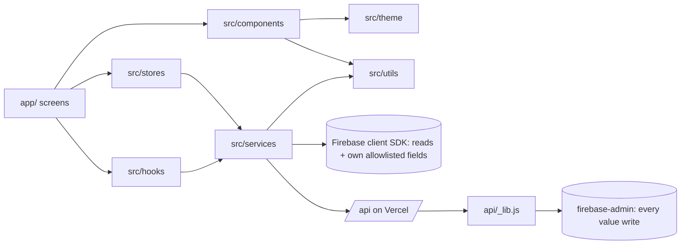
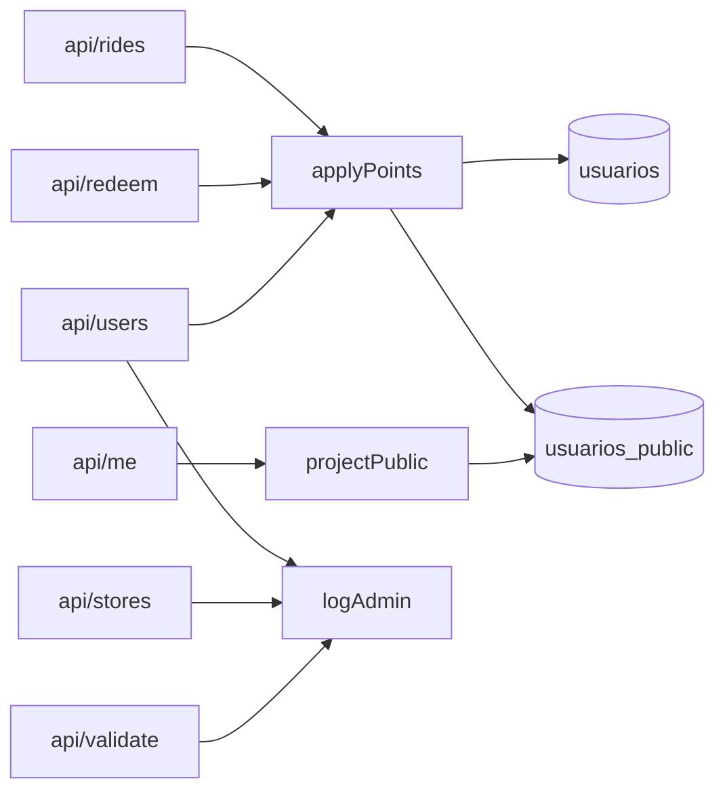
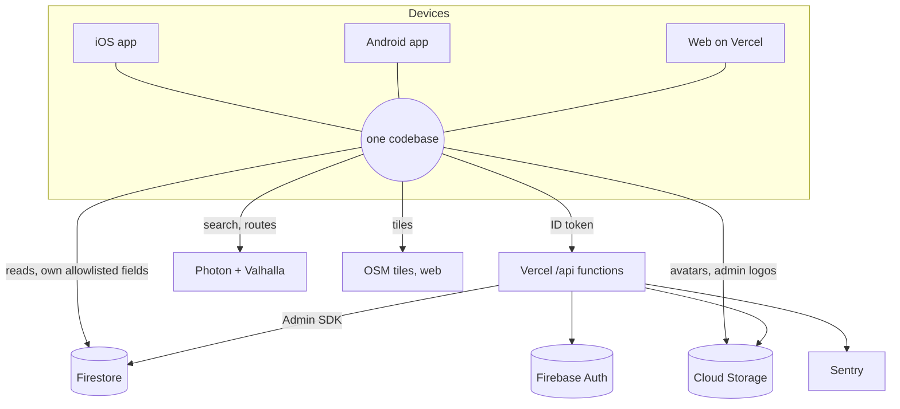
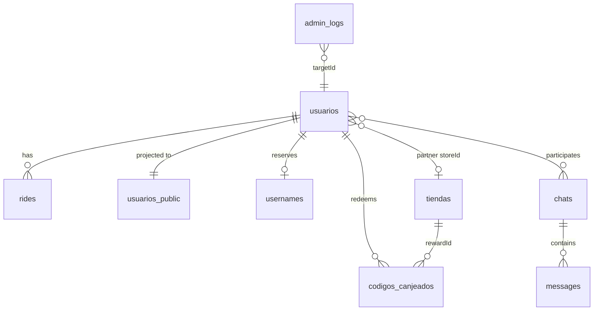

# Architecture Spine — EcoBike platform

Tags: **[ADOPTED]** the code already follows it. **[TARGET]** binding for new work; existing code is being brought in line (see `revision-arquitectura.md`).

## Design Paradigm

**Local-first client, authoritative server for value.** The device records and shows everything offline; anything with value (points, roles, redemptions, the store catalog, public profile data) is decided only by the server and mirrored back.

| Layer | Lives in | May depend on |
| --- | --- | --- |
| Screens (routes) | `app/` | components, hooks, stores, services |
| UI components | `src/components/` | theme, utils, types; read-only hooks |
| State | `src/stores/` (Zustand) | services, utils |
| Services (I/O) | `src/services/` | firebase client SDK, `api.ts`, utils |
| Domain rules (pure) | `src/domain/`, `src/types/` | `src/utils/` only |
| Generic helpers | `src/utils/` | nothing app-level |
| Server | `api/*.js` + `api/_lib.js` | firebase-admin only |

## Invariants & Rules

### AD-1 — The server is the only writer of value [ADOPTED; allowlist TARGET]

- **Binds:** `puntosAcumulados`, `weekPoints`/`weekKey`, rides docs, redemption codes, `role`/`isAdmin`/`storeId`, `cuentaActiva`, `amigos`/friend requests, `usernames`, `chats`/`messages`, `tiendas`, `admin_logs`, store logos in Storage.
- **Prevents:** a client granting itself value; a new value field becoming client-writable by omission.
- **Rule:** these are written only by `api/*.js` through firebase-admin. `firestore.rules` defaults to deny and lets a client update its own `usuarios` doc only through an **allowlist** of profile fields (`keys().hasOnly([...])`), never a denylist. Store logos may be uploaded directly by admins (Storage rule), and the store write that references them goes through the API.

### AD-2 — One scoring rulebook, two copies kept identical by test [ADOPTED]

- **Binds:** `src/domain/rideScore.ts`, `src/domain/week.ts`, `api/_lib.js` (`analyzeTrack`, `sanitizeTrack`, `scoreRide`, `capRidePoints`, `weekKey`, constants).
- **Prevents:** the finish screen promising points the server refuses; client/server drift in scoring or week boundaries.
- **Rule:** a change lands in both copies in one commit and `scoreParity.test.ts` (scoring and week keys) passes. The server's result overwrites the local one on sync.

### AD-3 — "Verified" and time windows have one definition each [ADOPTED]

- **Binds:** achievements, missions, streaks, the 3-ride redemption gate, admin stats, league.
- **Prevents:** one feature counting walks or rejected rides while another doesn't; two meanings of "today".
- **Rule:** client uses `isVerified`/`verifiedRides` (`src/domain/verified.ts`); server uses `rides.verified == true`. Never test `pointsEarned > 0`. Windows: **economy caps** = rolling 24 h server time; **missions/streak** = device local calendar day; **league** = ISO week in Colombia time (`weekKey`).

### AD-4 — Every privileged action is checked and audited on the server [ADOPTED]

- **Binds:** `api/users.js`, `api/stores.js`, `api/validate.js`, `app/settings/admin/`.
- **Prevents:** UI-only authorization; untraceable changes; four diverging definitions of "admin".
- **Rule:** handlers use `requireAdmin` / `isAdminUser` from `_lib.js` (the only server definition of admin, mirrored by `storage.rules`) before any read of private data, and call `logAdmin` for every write, including code validations and writes whose Auth step fails. Client checks (`AdminOnly`) are UX only.

### AD-5 — Platform differences live in paired files [TARGET for services]

- **Binds:** `src/services/*`, `src/components/map/RideMap`.
- **Prevents:** web importing native-only modules; `Platform.OS` branches spreading through shared logic.
- **Rule:** when a service's behavior differs by platform, use `name.ts` (native/default) + `name.web.ts` with the same exported API. `Platform.OS` is allowed for small UI details (haptics, styles) and in existing services until they are next touched.

### AD-6 — Local storage keeps summaries apart from GPS tracks [ADOPTED]

- **Binds:** `src/services/db.native.ts`, `db.web.ts`, `rides.service.ts`, every `listRides` caller.
- **Prevents:** parsing every GPS point of the history on each render or autosave; the web localStorage quota losing rides; a summary overwriting a stored track.
- **Rule:** `listRides` returns summaries with `points: []`; `getRide` and `unsyncedRides` return full tracks. A summary is never passed to `saveRide` (load the full ride with `getRide` first). Web stores each track under its own key, migrates the old format and, on a full quota, drops the oldest synced tracks, never a summary (`dbWeb.test.ts`).

### AD-7 — Serverless functions are a scarce resource [ADOPTED]

- **Binds:** `api/`.
- **Prevents:** a deploy failing at Vercel's 12-function limit (applies because `vercel.json` sets `framework: null`).
- **Rule:** every `api/` file not starting with `_` is a function (11 today). New endpoints are actions of an existing handler; helpers and tests start with `_`.

### AD-8 — External geo services are behind one module [ADOPTED]

- **Binds:** `src/services/routing.ts` (search, routing); OSM tiles in `RideMap.web.tsx`.
- **Prevents:** provider calls scattered across screens; no way to switch provider or honor fair-use rules.
- **Rule:** only `routing.ts` calls Photon/Valhalla, with timeouts on every request; search positions are coarsened to about 100 m (routing needs exact endpoints and says so in the privacy policy). Tile URLs live only in `RideMap.web.tsx`.

### AD-9 — One function moves points [ADOPTED]

- **Binds:** `api/rides.js`, `api/redeem.js`, `api/users.js`, `api/me.js`, any future bonus or refund.
- **Prevents:** five writers updating balance, public mirror and league week in five ways.
- **Rule:** points change only through `applyPoints(tx, uid, delta, kind)` in `_lib.js`, which updates `usuarios.puntosAcumulados`, the `usuarios_public` mirror and, when `kind` counts for the league (rides), `weekPoints`. Admin adjustments and redemptions do not change the league.

### AD-10 — The public profile is a server projection with bounded reads [ADOPTED]

- **Binds:** `usuarios_public`, `api/me.js`, `social.service.ts`, `firestore.rules`.
- **Prevents:** unvalidated data reaching the public mirror; any user enumerating every profile; the "hide me" setting being client-side only.
- **Rule:** the server writes `usuarios_public` only through `projectPublic()` in `_lib.js` (same validators as the rules) and `applyPoints`; the owner may edit only `nombre`, `apellido`, `profileImageUrl` and `buscable`, validated by the rules. Rules allow other users' docs by id only (no list queries); username search and availability go through `/api/friends`, which honors `buscable`. Friend lists are not part of the public mirror.

### AD-11 — One answer to "is this a real account?" [ADOPTED]

- **Binds:** `authStore`, `rideStore`, points/redeem hooks, any value action.
- **Prevents:** a signed-in user treated as a guest after a failed profile fetch (local balance, locally invented codes).
- **Rule:** a real account is `firebaseUser && !isGuest` (`useAvailablePoints().isRealAccount`), never "the profile loaded". A failed profile fetch keeps the last known profile; until one loads the balance reads 0 and the server decides every value action. Guest points and codes are demo data and are never migrated to an account.

### AD-12 — Only permanent rejections are final [ADOPTED]

- **Binds:** `api/_lib.js` `handler`, `src/services/api.ts`, sync queues.
- **Prevents:** a temporary 4xx (profile not created yet, expired token) zeroing a real ride forever.
- **Rule:** the client drops or zeroes a queued item only on 400, 403, 409, 413 or 422 (`PERMANENT_REJECTIONS` in `rides.service.ts`); 401, 404, 429, 5xx and network errors are retried. A new permanent status must be added there and to the server's docs together.

### AD-13 — Every endpoint has a bounded cost per user [ADOPTED for export and friends; TARGET for the rest]

- **Binds:** `api/*`.
- **Prevents:** loops multiplying Firestore reads (export, friends, messages) or storing unbounded docs.
- **Rule:** each endpoint caps reads per call and calls per user per window with `rateLimit(uid, action, everyMs)` from `_lib.js` (state in server-only `rate_limits/<uid>`, 429 beyond it); exports cap their size below Vercel's response limit.

### AD-14 — No personal data in URLs, logs or a shared device [ADOPTED]

- **Binds:** `api/*`, `src/services/*`, `authStore.signOut`.
- **Prevents:** emails in logged query strings; GPS history readable by the next person on a shared browser.
- **Rule:** personal data travels in request bodies, never query strings, and logs record ids, not emails or names. Sign-out on web uploads pending rides, then clears local rides, achievements and redemptions (never a ride that exists only locally). Deleting a photo deletes its file.

### AD-15 — The API stays compatible with installed apps [TARGET]

- **Binds:** `api/*` contracts.
- **Prevents:** a server deploy breaking phones that haven't updated.
- **Rule:** request and response changes are additive; a removed field or endpoint ships only after a minimum-version gate (`/api/me` returns `minAppVersion`) is in place.

## Consistency Conventions

| Concern | Convention |
| --- | --- |
| Naming | Firestore keeps legacy Spanish collection names (`usuarios`, `usuarios_public`, `tiendas`, `codigos_canjeados`); new collections are snake_case English (`admin_logs`). Code in English; user-facing copy in Spanish. |
| IDs | Doc ids checked with `isDocId` on the server; ride ids generated on device (idempotent sync by id). |
| Time | Epoch ms in rides; `serverTimestamp()` for server-owned times; windows per AD-3. |
| Errors | `httpError(status, message)`; JSON `{ error, requestId, retryable }`; Spanish messages. |
| Value fields | Integer points ≥ 0; prices read from `tiendas/<storeId>.pointsRequired` on the server only. |
| Copy that states rules | Numbers imported from `src/domain/rideScore.ts`, never typed into text. |
| Config and secrets | `EXPO_PUBLIC_*` = public client config only; service account and Sentry DSN for the server are Vercel env vars; nothing secret in the repo or bundle. |
| New user-linked data | Any new collection or file keyed by user is added to `deleteUserData` and `api/export.js` in the same change. |
| Palette and motion | Lime `#7BF510` only for functional state; neutral elevation; motion tokens from `src/theme/motion.ts`. |

## Stack

| Name | Version |
| --- | --- |
| Expo SDK | 57 (expo ~57.0.26) |
| React Native / React | 0.86.3 / 19.2.3 |
| expo-router | ~57.0.24 |
| react-native-reanimated | 4.5.1 (SDK-aligned) |
| Firebase JS SDK / firebase-admin | 12.19.0 (+ `@firebase/auth` pin) / ^13.10.0 |
| expo-maps (alpha, iOS) / MapLibre RN (Android) / Leaflet + react-leaflet (web) | ~57.0.3 / 11.4.1 / 1.9.4 + 5.0.0 |
| expo-sqlite / Zustand | ~57.0.3 / 5.0.15 |
| Node (Vercel functions) | 24.x |
| Monitoring | Sentry (client + server), request ids |

## Structural Seed

### Environments and operations

| Concern | Decision |
| --- | --- |
| Environments | One Firebase project (`ecobike-9dedd`) for dev, preview and production [ASSUMPTION: acceptable at current scale]; Vercel production holds the service account; preview deployments have no server credentials, so `/api` there is not usable. |
| Release order | API (`vercel deploy --prod`) first, then rules and indexes (`npm run deploy:rules`), then app builds (EAS). Rules must never require a field the deployed API doesn't write yet. |
| Enforcement gate | CI (`.github/workflows/ci.yml`): typecheck, unit + parity tests, rules emulator, web build, Playwright. Nothing merges red. |
| Monitoring | Sentry on client and server; every API response carries `requestId`. |
| Plans | Vercel Hobby (non-commercial use only) and the Firebase plan are open questions for a launch with partner stores. |

## Deferred

- **iOS heading arrow** — Android (MapLibre) and web draw the arrow; iOS keeps Apple's system marker. Moving iOS to MapLibre would unify all three.
- **App Check / device attestation on `/api/rides`** — needs a native module (`@react-native-firebase/app-check` or `@expo/app-integrity`) since the JS SDK's providers are web-only; Play Integrity requires Play Store distribution.
- **Expo SDK 58 / RN 0.88** — upgrade after it is stable; **firebase-admin 14** (Node ≥ 22) in its own change.
- **Routing provider** — FOSSGIS Valhalla allows 1 req/s per user and asks apps to identify themselves; register and send the client id, then self-host or pay before heavy use.
- **Hosting plan** — Vercel Pro if EcoBike is commercial.
- **Cross-device ride deletion** — the pull only adds; a ride deleted on one device stays on others until server reconciliation exists.
- **Achievements stored per device** — they are derived data; a public achievements feature needs them server-side first.
- **Audit-log retention**, **last-admin protection**, **privacy-policy versioning and re-consent**, **web bundle splitting**, **CSP header and CORS narrowing**, **line-ending normalization** — tracked in `revision-arquitectura.md`.
