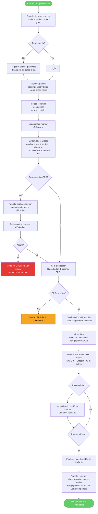
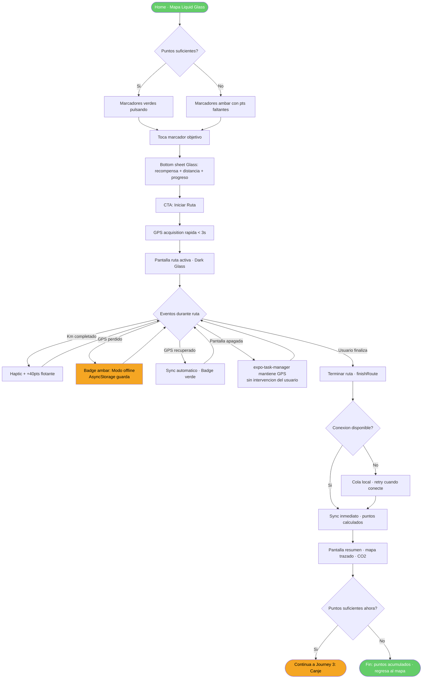
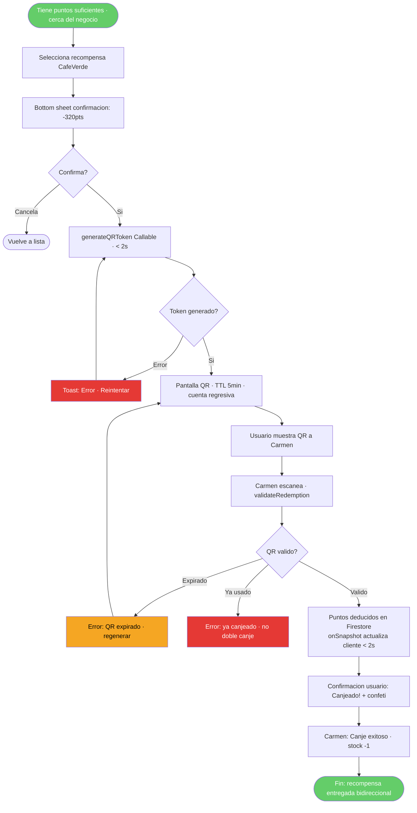
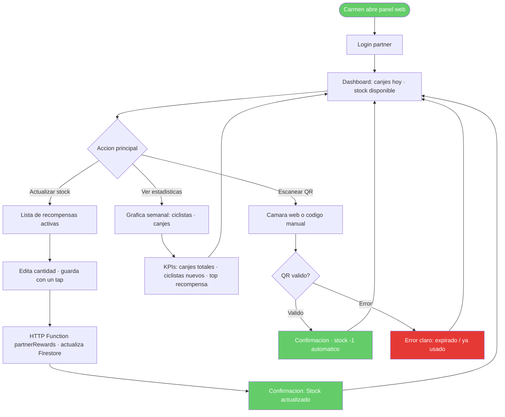

# UX Design Specification — EcoBike

**Author:** DONA
**Date:** 2026-08-21

---

<!-- UX design content will be appended sequentially through collaborative workflow steps -->

## Executive Summary

### Project Vision

EcoBike convierte cada kilómetro pedaleado en puntos canjeables por recompensas reales en negocios locales. La propuesta central no es solo una app de tracking: es un mapa vivo donde pedalear tiene destinos concretos con valor económico tangible hoy — el primero en el mercado hispano de movilidad.

La experiencia UX debe resolver un problema de diseño emocional: el sistema de puntos ya existe, pero le faltan los microinstantes de confianza y dopamina que convierten una app funcional en un hábito.

### Target Users

**Ciclista urbano (usuario principal):**
- Perfil: 18-40 años, Latinoamérica. Pedalea por traslado o ejercicio.
- Personas representativas: Mariana (28, diseñadora, usuaria activa), Roberto (35, mensajero, condiciones extremas), Diego (22, estudiante, nuevo usuario).
- Contexto de uso: en movimiento, pantalla apagada durante el pedaleo, conexión intermitente, batería limitada.
- Necesidad emocional: sentir que cada pedalada vale algo real hoy — no acumular puntos abstractos para un futuro lejano.

**Negocio local partner (usuario secundario, panel web):**
- Perfil: Carmen (42, dueña de CaféVerde). No tech-savvy, gestiona desde web.
- Contexto de uso: escritorio o tablet, necesita acción rápida y resultado visible.
- Necesidad: actualizar stock sin fricción y ver cuántos ciclistas llegaron gracias a su recompensa.

### Key Design Challenges

1. **GPS invisible pero confiable** — El usuario pedalea con pantalla apagada. La UX debe transmitir confianza absoluta de que "todo se está grabando" mediante indicadores de estado claros antes de cerrar la pantalla y un estado de recuperación memorable si hubo interrupción.

2. **Mapa como motor de engagement activo** — Transformar el mapa de feature pasivo a cazador de tesoros con destinos reales y alcanzables. Los marcadores deben comunicar valor inmediato: nombre, recompensa, km desde mi posición, puntos necesarios.

3. **Arco emocional del kilómetro** — Cada km debe sentirse como un micrologro. El feedback háptico + animación flotante "+Xpts" es el corazón emocional de la experiencia durante la ruta.

4. **Onboarding con gancho en <60 segundos** — La primera pantalla no puede ser un formulario. Debe mostrar prueba social real (ruta de un usuario real con puntos y recompensa ganada) y llevar al usuario al mapa con recompensas en menos de 60 segundos.

5. **Panel web para partners** — Audiencia y contexto completamente diferentes al ciclista. UX simplificado, orientado a una acción única: actualizar stock y ver resultados del día.

### Design Opportunities

1. **Primera pantalla como prueba social inmediata** — Antes del registro, mostrar: "Mariana pedaleó 9.2km y ganó un café gratis". Transforma la duda en acción sin necesidad de explicar el producto.

2. **Microinstantes de dopamina diseñados** — Confeti al iniciar ruta, "+Xpts" flotante + háptico por km, badge de bienvenida en primera ruta, animación de racha al día consecutivo. Cada interacción tiene un momento de celebración.

3. **El mapa busca al ciclista** — Marcadores de recompensas con distancia desde posición actual, puntos necesarios y nombre de la recompensa. Zonas x2 con visual diferenciado. El destino te llama antes de que empieces a pedalear.

4. **Perfil como identidad ciclista viva** — Historia personal: CO₂ evitado, km totales, racha actual, nivel progresivo, historial de rutas con miniatura de mapa. El perfil crece con cada ruta — no es un dashboard de datos, es tu huella ciclista.

---

## Core User Experience

### Defining Experience

EcoBike es, en esencia, un **convertidor de kilómetros en valor real**. La experiencia se define por un ciclo de tres beats:

1. **Iniciar** — tap, GPS confirma, pantalla apagada: el ciclista pedalea sin fricciones tecnológicas
2. **Acumular** — cada km genera feedback háptico + "+Xpts" flotante: el progreso es tangible y celebrado
3. **Canjear** — puntos → QR → recompensa real en un negocio visible en el mapa antes de salir

El diferenciador no es el tracking de GPS (commodity) sino la **densidad emocional entre kilómetro y recompensa**: microinstantes de dopamina que hacen que cada pedalada valga algo *hoy*.

### Platform Strategy

**Canal primario:** Expo SDK 57 (iOS + Android) — ciclistas en movimiento, pantalla apagada, GPS background, conexión intermitente.

**Canal secundario:** Web (Expo Router + react-leaflet) — panel de partners como Carmen, gestión de stock y métricas desde escritorio o tablet.

**Restricciones de plataforma que moldean la UX:**
- iOS/Android: background location requiere confirmación explícita del usuario → el onboarding debe motivar el permiso antes de pedirlo
- Batería limitada: la app no puede ser hambrienta de recursos → GPS poll cada 30s, no continuo
- Conexión intermitente: offline-first → el ciclista nunca pierde una ruta por falta de señal
- Web/partner: sin capacidades nativas → QR scan desde cámara web o código manual

### Effortless Interactions

Las interacciones que deben requerir cero cognición:

| Acción | Estándar actual | EcoBike target |
|--------|----------------|----------------|
| Iniciar ruta | 3-4 taps + confirmación | 1 tap grande desde pantalla home |
| Ver puntos actuales | Navegar a sección | Siempre visible en header |
| Ver recompensas alcanzables | Buscar en lista | Marcadores en mapa con distancia y puntos necesarios |
| Canjear recompensa | Proceso multistep | Scan QR → confirmación en 1 tap |
| Terminar ruta | Buscar botón | Botón siempre visible durante ruta activa |

Lo que debe ocurrir **automáticamente sin intervención del usuario:**
- Guardado de checkpoints GPS cada 30s en AsyncStorage
- Sincronización de ruta al recuperar conexión
- Notificación push de racha en riesgo (23:00 si no hay ruta del día)
- Actualización de puntos tras finalizar ruta (≤30s)

### Critical Success Moments

**Momento 1 — El primer kilómetro** *(make or break)*
El feedback háptico + animación "+Xpts" al completar el primer km es el corazón emocional. Si el usuario no siente ese momento, la app es "otro tracker más". Este momento NO puede fallar por GPS impreciso o UI lenta.

**Momento 2 — Fin de primera ruta**
La pantalla de resumen post-ruta debe celebrar: puntos ganados, km recorridos, CO₂ evitado, y — crítico — mostrar qué recompensas están ahora al alcance. El usuario debe terminar pensando "¿cuándo salgo otra vez?", no "¿qué hago con estos puntos?"

**Momento 3 — Primera recompensa canjeada**
El instante en que Carmen escanea el QR y el ciclista ve "¡Recompensa canjeada!" es la prueba social del sistema. Este flujo debe ser impecable: latencia baja, confirmación visual clara, cero ambigüedad.

**Momento 4 — Onboarding en <60 segundos**
La primera pantalla no puede ser un formulario. Antes del registro, mostrar prueba social real (ruta de Mariana: 9.2km → café gratis). El usuario debe llegar al mapa con recompensas visibles antes de que su atención se agote.

### Experience Principles

1. **Dopamina antes de datos** — Cada interacción tiene un momento de celebración. Puntos, badges, confeti, háptico. El sistema emocional primero, las métricas después.

2. **GPS invisible, confianza visible** — El usuario pedalea con pantalla apagada. La UI debe transmitir "todo se está grabando" antes de apagar la pantalla, no después.

3. **El mapa como motor de deseo** — Los marcadores de recompensas en el mapa no son pins informativos: son destinos que llaman al ciclista antes de que salga. Distancia, puntos necesarios, nombre de la recompensa — el mapa busca al ciclista.

4. **Fricción cero en el ciclo core** — Iniciar → pedalear → terminar → ver recompensas: este loop debe ocurrir sin fricciones cognitivas. Cada tap adicional es un punto de abandono.

5. **Valor real hoy, no puntos abstractos mañana** — La UX debe comunicar constantemente que las recompensas son reales, locales y alcanzables. No "acumula X puntos", sino "te faltan 120pts para el café de CaféVerde a 0.8km".

---

## Desired Emotional Response

### Primary Emotional Goals

**Emoción primaria: Orgullo ciclista + recompensa merecida**

El usuario debe sentir que *se ganó algo real*. No la euforia vacía de un juego móvil, sino la satisfacción concreta de "pedaleé, lo registré, me lo deben". EcoBike no es gamificación artificial — es reconocimiento de un esfuerzo real.

**Emoción diferenciadora frente a competidores:**
Strava da ego. Google Maps da ruta. EcoBike da **valor local tangible**. La emoción que hace que alguien llame a un amigo: "pedalé al trabajo y me gané un café gratis en la esquina de mi casa".

**Emoción secundaria: Confianza absoluta en el sistema**
El ciclista pedalea con pantalla apagada 30 minutos. Durante ese tiempo, la emoción dominante debe ser *tranquilidad* — saber que el sistema está trabajando sin necesitar verlo. Si hay ansiedad sobre si "se está grabando o no", la experiencia fracasa.

### Emotional Journey Mapping

| Momento | Emoción target | Emoción a evitar |
|---------|---------------|-----------------|
| Primera apertura de app | Curiosidad + prueba social ("esto es real") | Desconfianza, confusión |
| Onboarding / registro | Anticipación, entusiasmo controlado | Fricción, impaciencia |
| Primer tap "Iniciar Ruta" | Excitación leve + compromiso | Duda ("¿se activó?") |
| Pedaleo con pantalla apagada | **Tranquilidad / confianza** | Ansiedad ("¿está grabando?") |
| Primer km completado (háptico + "+Xpts") | **Deleite súbito + orgullo** | Nada — este momento no puede ser silencioso |
| Fin de ruta → pantalla de resumen | Celebración + hambre de más | Aburrimiento, "¿eso es todo?" |
| Ver recompensas alcanzables en mapa | Deseo + motivación ("ya casi") | Frustración ("están muy lejos") |
| Primera recompensa canjeada | **Satisfacción profunda + pertenencia** | Duda sobre validez del QR |
| Día sin pedalear (notificación racha) | Motivación saludable | Culpa excesiva o presión |
| Perfil con historial de rutas | Identidad ciclista, orgullo acumulado | Indiferencia |

### Micro-Emotions

**Confianza > Escepticismo**
El sistema de puntos es nuevo en el mercado hispano. El usuario llegará con "¿esto es real?" como pregunta de fondo. Cada elemento de UI que muestra prueba — el nombre real del negocio, la distancia exacta, la ruta real de otro usuario — destruye el escepticismo antes de que se consolide.

**Deleite > Satisfacción simple**
Satisfacción es "funcionó". Deleite es "no esperaba que fuera así de bueno". EcoBike debe apuntar a deleite en los 3 momentos core: primer km, fin de ruta, primer canje. El resto puede ser satisfacción estándar.

**Pertenencia > Logro individual**
A largo plazo, el usuario debe sentir que pertenece a una comunidad de ciclistas que "entienden" el valor de pedalear. Racha compartida, CO₂ evitado colectivo, "X ciclistas ya canjearon en CaféVerde este mes" construyen este sentido.

**Anticipación > Ansiedad**
La notificación de racha (23:00) debe sentirse como un recordatorio de algo bueno que espera, no como presión. Tono: "Tu racha de 5 días te espera mañana 🚴" — no "¡No pierdas tu racha!"

### Design Implications

| Emoción target | Decisión UX que la genera |
|---------------|--------------------------|
| Tranquilidad durante pedaleo | Pantalla pre-apagado con indicador GPS activo y checkpoint count visible |
| Deleite en primer km | Háptico fuerte (Impact) + animación "+Xpts" desde abajo + sonido opcional |
| Orgullo en fin de ruta | Resumen con mapa trazado, puntos grandes, CO₂, CTA hacia recompensas |
| Deseo ante el mapa | Pill flotante en marcadores: "[☕] CaféVerde · 0.8km · te faltan 120pts" |
| Satisfacción en canje | Confeti localizado + "¡Recompensa canjeada!" con nombre y foto del negocio |
| Pertenencia | Perfil con "Tu huella ciclista": racha, km totales, CO₂, nivel visual |
| Confianza | Onboarding muestra ruta real de Mariana con puntos ganados — antes de pedir datos |

**Interacciones que crean emociones negativas a evitar:**
- Modal de permisos de ubicación sin contexto previo → ansiedad/rechazo
- Spinner de carga sin estado durante GPS acquisition → duda
- Pantalla de puntos sin "cuánto me falta para X recompensa" → frustración abstracta
- Error de red silencioso durante fin de ruta → pánico de pérdida de datos

### Emotional Design Principles

1. **Celebrar antes de informar** — El feedback emocional (háptico, animación, sonido) ocurre en el instante del logro. Las métricas llegan después. El orden importa.

2. **Nunca dejar al usuario en silencio** — Durante GPS acquisition, pedaleo y sync de ruta: siempre hay un indicador de estado. El silencio se percibe como error.

3. **Hacer el progreso visible antes de que sea útil** — Mostrar "te faltan X puntos para Y recompensa" incluso cuando X es grande. El ciclista debe saber hacia dónde va, no solo cuánto tiene.

4. **El error también tiene dignidad** — Si algo falla, el mensaje no es técnico ni alarmista. Es humano: "Perdimos señal un momento, pero guardamos tu ruta. Todo está bien." La confianza se construye especialmente en los momentos de fallo.

5. **Recompensar el regreso** — El usuario que vuelve después de días sin pedalear no siente vergüenza. La app lo recibe como a alguien que fue extrañado, no como a alguien que falló.

---

## UX Pattern Analysis & Inspiration

### Inspiring Products Analysis

**1. Duolingo — Maestro del loop de hábito con dopamina**

Lo que hace bien: racha como núcleo de retención siempre visible, celebración desproporcionada para logros pequeños (confeti + animaciones + sonidos), puntos siempre contextualizados con qué pueden comprar, notificaciones con personalidad amigable no culposa.

**Lección para EcoBike:** La racha de días ciclistas debe tener el mismo peso central que en Duolingo. El diseño de la notificación de racha es crítico — debe ser memorable y nunca acusatorio.

**2. Strava — Identidad ciclista como producto**

Lo que hace bien: el mapa trazado ES el logro visual (no un número), segmentos como microdesafíos en rutas cotidianas, feed social que celebra sin crear presión, KOMs como sistema de status real para ciclistas.

**Lección para EcoBike:** La pantalla de fin de ruta debe tener el mapa trazado como elemento hero — no los puntos. Los puntos son la recompensa, el mapa es el orgullo. La miniatura de mapa en el historial del perfil convierte cada ruta en un recuerdo visual.

**3. Waze — Mapa como experiencia activa, no pasiva**

Lo que hace bien: el mapa es el producto (no el fondo), iconos de comunidad que lo hacen vivo, cámara que sigue al usuario automáticamente, información relevante en el momento correcto.

**Lección para EcoBike:** Los marcadores de recompensas deben ser ciudadanos de primer nivel del mapa — no pins genéricos. Deben pulsar, indicar distancia, y responder al movimiento del usuario.

**4. Nike Run Club — Celebración del esfuerzo físico**

Lo que hace bien: medallas por hitos (primera ruta, 10km, primer mes), pantalla de fin de carrera diseñada para compartir en redes, achievements que reconocen el comportamiento no solo la performance.

**Lección para EcoBike:** Los badges de hito deben ser visuales memorables. La pantalla de fin de ruta debe estar diseñada para ser screenshot-able — es marketing orgánico gratuito.

**5. Rappi / Uber Eats — Negocio local como destino concreto**

Lo que hace bien: el negocio siempre tiene nombre, foto, distancia — nunca abstracto. Estado en tiempo real elimina ansiedad post-acción. "Recomendados cerca de ti" como motor de descubrimiento por posición.

**Lección para EcoBike:** La recompensa en el mapa debe mostrar el negocio como destino concreto: foto, nombre real, dirección. No "Descuento 20% en cafetería" — sino "Café americano en CaféVerde, Av. Insurgentes 45, 0.8km".

### Transferable UX Patterns

**Patrones de Navegación:**

| Patrón | Origen | Aplicación en EcoBike |
|--------|--------|----------------------|
| Tab bar con acción central elevada | Instagram, Strava | Tab "Iniciar Ruta" como FAB elevado en centro del tab bar |
| Mapa como pantalla home | Waze, Google Maps | Mapa con recompensas es pantalla de inicio post-login |
| Bottom sheet progresivo | Google Maps, Airbnb | Detalle de recompensa aparece como bottom sheet al tocar marcador |

**Patrones de Interacción:**

| Patrón | Origen | Aplicación en EcoBike |
|--------|--------|----------------------|
| Streak con ritual de recuperación | Duolingo | Racha visible en header, notificación 23:00, congelar racha (Growth) |
| Feedback háptico + animación sincronizada | Apple Pay, Duolingo | Km completado: Impact haptic + "+Xpts" animado + ding suave |
| Estado persistente durante proceso largo | Uber | Ruta activa: indicador permanente con km, puntos y GPS status |
| Pantalla de resumen compartible | Nike Run Club, Strava | Fin de ruta: screenshot-ready con mapa, puntos, CO₂ |

**Patrones Visuales:**

| Patrón | Origen | Aplicación en EcoBike |
|--------|--------|----------------------|
| Dark mode para actividad nocturna | Strava, Nike RC | Mapa y pantalla de ruta activa en modo oscuro automático por hora |
| Cards con urgencia visual | Rappi | "Quedan 3 disponibles" en marcadores con bajo stock |
| Progress ring para métricas | Apple Watch, Strava | Progress ring de "puntos hacia próxima recompensa" en home y perfil |

### Anti-Patterns to Avoid

1. **Gamificación vacía sin valor real** — Puntos y badges sin conexión a recompensas tangibles. En EcoBike: nunca mostrar puntos sin contexto de "esto te alcanza para X recompensa específica".

2. **Onboarding-form como primera pantalla** — Pedir datos antes de mostrar valor. En EcoBike: primera pantalla es prueba social, no formulario.

3. **Spinner genérico durante GPS acquisition** — "Buscando señal GPS..." anónimo crea ansiedad. En EcoBike: el estado tiene personalidad y comunica progreso activo.

4. **Mapa como fondo decorativo** — El mapa es el producto, no el fondo. En EcoBike: mapa ocupa pantalla completa, la información se superpone como overlay.

5. **Notificaciones de presión** — "¡Llevas 3 días sin pedalear!" como acusación. En EcoBike: tono siempre de invitación con valor concreto, nunca de culpa.

6. **Panel de partner con curva de aprendizaje** — Carmen (no tech-savvy) no puede aprender un dashboard complejo. En EcoBike: una acción primaria visible, el resto progresivo.

### Design Inspiration Strategy

**Adoptar directamente:**
- Mapa como pantalla home (Waze) — sin fricción de navegación hasta el core
- Feedback háptico + animación en micrologros (Duolingo) — el km completado tiene el mismo peso que una lección terminada
- Pantalla de resumen compartible (Nike Run Club) — marketing orgánico integrado en la experiencia
- Bottom sheet para detalle de recompensa (Google Maps) — mantiene contexto del mapa

**Adaptar al contexto EcoBike:**
- Racha de Duolingo → racha ciclista con consecuencia real (acceso a zonas x2 por racha ≥7 días)
- Estado de viaje de Uber → estado de ruta activa con GPS confidence indicator, no solo timer
- Cards de negocio de Rappi → cards de recompensa con foto del negocio + distancia desde posición actual

**Evitar activamente:**
- Dashboard de métricas como home → el mapa va primero, las métricas son secundarias
- Notificaciones de culpa → solo invitaciones con valor concreto
- Gamificación desconectada del valor real → cada punto siempre contextualizado con recompensas alcanzables

---

## Design System Foundation

### Design System Choice

**NativeWind v4 + Design Tokens EcoBike** — sistema de diseño basado en Tailwind CSS adaptado para Expo SDK 57 (iOS/Android/Web).

Enfoque híbrido:
- **NativeWind v4** como capa de estilos utility-first cross-platform
- **Design tokens propios** para la identidad de marca EcoBike (colores, tipografía, espaciado, radios)
- **Componentes custom** para elementos de gamificación sin equivalente en ningún sistema existente
- **expo-symbols + @expo/vector-icons** para iconografía consistente en todas las plataformas

### Rationale for Selection

1. **Continuidad con el prototipo existente** — El prototipo React+Vite ya usa Tailwind. NativeWind lleva esa sintaxis a React Native sin reaprender un nuevo sistema de componentes.

2. **Control total sobre la experiencia de gamificación** — Ningún design system establecido tiene componentes para "+Xpts" flotante, confeti de ruta, progress ring de puntos, o indicador GPS. EcoBike construye estos desde cero — NativeWind da la base sin imponer estructura de componentes.

3. **Universal por diseño** — NativeWind v4 genera estilos nativos para iOS/Android y CSS estándar para web — el mismo código funciona en todas las plataformas, consistente con la arquitectura Expo Router.

4. **Velocidad de MVP** — Tailwind utility-first permite construir y iterar pantallas sin crear componentes reutilizables prematuros.

5. **Tokens de marca como contrato de diseño** — Los colores, tipografía y espaciado se definen una vez en `tailwind.config.js` y se consumen en toda la app.

### Implementation Approach

```
ecobike/
├── tailwind.config.js          # Design tokens + tema EcoBike
├── global.css                  # NativeWind base styles
└── src/
    ├── components/
    │   ├── ui/                 # Componentes base (Button, Card, Badge)
    │   └── ecobike/            # Componentes de dominio (RouteCard, RewardMarker, PointsFloat)
    └── constants/
        └── theme.ts            # Tokens tipados para uso en animaciones (Reanimated)
```

**Stack de estilos:**
- Estilos estáticos → `className` de NativeWind
- Animaciones de gamificación → `react-native-reanimated` + tokens de `theme.ts`
- Feedback háptico → `expo-haptics` (Impact / Notification)
- Iconos → `@expo/vector-icons` (Ionicons) + custom SVGs para icons de marca

### Customization Strategy

**Design tokens de EcoBike** (colores preview — detalle completo en Visual Foundation):
- `brand.primary`: Verde EcoBike — acción, progreso
- `brand.secondary`: Ámbar — puntos, recompensas
- `brand.accent`: Verde brillante — logros, celebración
- `surface.dark`: Pantalla de ruta activa (dark mode)
- `surface.light`: Home y mapa (light mode)

**Componentes custom prioritarios** (no existen en ningún design system):
1. `PointsFloat` — animación "+Xpts" que emerge desde abajo con Reanimated
2. `GPSStatusBar` — indicador de confianza GPS con estado verde/ámbar/rojo
3. `RewardMarker` — pin de mapa con pill de información contextual
4. `RouteCompleteSummary` — pantalla de resumen screenshot-ready
5. `StreakBadge` — badge de racha con animación de fuego al alcanzar hitos
6. `ProgressRing` — anillo de progreso hacia próxima recompensa

---

## 2. Core User Experience

### 2.1 Defining Experience

**"Ve una recompensa en el mapa → pedalea hacia ella → canjeala"**

Este es el loop que define EcoBike. No es "acumula puntos" (abstracto). No es "registra tu ruta" (commodity). Es: **ver un destino real en el mapa que vale algo, salir a pedalearlo, y llegar a canjearlo**.

La secuencia en palabras del usuario:
> *"Abrí la app, vi que el café de la esquina estaba a 2.3km, me faltaban 40 puntos, salí a dar la vuelta, llegué al café con el QR en la pantalla, Carmen me lo escaneó y me dio el café. Así de simple."*

### 2.2 User Mental Model

El ciclista urbano ya entiende dos cosas por separado:
1. **Maps + distancia** (Google Maps, Waze): "veo un lugar en el mapa, navego hacia él"
2. **Puntos + canje** (tarjeta de fidelidad): "acumulo sellos, canjeo un producto"

EcoBike combina estos dos modelos conocidos: **el mapa con puntos canjeables en destinos visibles**. No requiere aprender un concepto nuevo — requiere conectar dos patrones que el usuario ya domina.

**Dónde se rompe el modelo sin buen diseño:**
- Pins en mapa sin contexto → usuario no sabe qué necesita para canjear
- Puntos sin mostrar hacia qué recompensa van → el sistema se siente abstracto como "airmiles"
- Canje con navegación compleja → el momento de triunfo se convierte en fricción

**Preguntas del usuario al iniciar:**
- "¿Cuánto necesito pedalear para ganar algo?"
- "¿Hay algo cerca que me interese?"
- "¿Mi ruta de hoy me alcanza para alguna recompensa?"

### 2.3 Success Criteria

| Criterio | Métrica | Estado visible |
|----------|---------|---------------|
| Recompensas alcanzables visibles antes de iniciar | Mapa carga con marcadores en ≤2s | Marcadores con puntos necesarios |
| GPS activo sin ansiedad | Confirmado en ≤5s | Indicador verde + checkmark |
| Cada km se siente | Háptico + "+Xpts" en ≤500ms | Animación flotante visible |
| Fin de ruta celebra el logro | Pantalla de resumen en ≤3s | Mapa trazado + puntos + CTA recompensas |
| Canje funciona en primer intento | QR en ≤2s, escaneo sin fricción | Confirmación + nombre del negocio |

### 2.4 Novel UX Patterns

**Patrones establecidos reutilizados:**
- Mapa con pins de destino (Google Maps / Waze) — familiar, cero educación requerida
- Barras de progreso de puntos (tarjetas de fidelidad) — familiar para cualquier usuario de retail
- Feedback háptico por acción (Apple Pay) — instintivo

**Patrones innovadores únicos de EcoBike:**
- **Mapa-como-catálogo de recompensas** — los pins son ofertas específicas con precio en puntos y distancia desde posición actual. Primero en el mercado hispano de movilidad.
- **GPS confianza proactiva** — antes de apagar pantalla, "GPS activo, guardando cada 30s". Una promesa activa, no un estado pasivo.
- **Arco km → recompensa en tiempo real** — durante la ruta, mostrar cuántos puntos llevas y cuánto te falta para la recompensa elegida antes de salir.

**Cómo se enseña el patrón en primer uso:**
El onboarding no explica — muestra. Primera pantalla post-registro: mapa con una recompensa resaltada y "Esta es Mariana. Pedaleó 9.2km → ganó este café. ¿Empiezas tu primera ruta?" CTA directo al mapa.

### 2.5 Experience Mechanics

**FASE 1 — VER (antes de salir)**

| Paso | Acción del usuario | Respuesta del sistema |
|------|-------------------|----------------------|
| 1 | Abre la app | Mapa centrado en posición actual, marcadores de recompensas visibles |
| 2 | Toca un marcador | Bottom sheet: foto del negocio, nombre de recompensa, puntos necesarios, distancia |
| 3 | Revisa puntos actuales | Progress indicator: "tienes X pts · te faltan Y para este canje" |
| 4 | Toca "Iniciar Ruta" | Confeti + GPS acquisition + "GPS activo · todo se está grabando" |

**FASE 2 — PEDALEAR (ruta activa)**

| Evento | Acción del sistema | Feedback |
|--------|-------------------|---------|
| GPS confirmado | Pantalla de ruta activa | Mapa en vivo, km, puntos acumulados, botón "Terminar" siempre visible |
| Cada km completado | Cloud Function acumula puntos | Impact haptic + animación "+Xpts" flotante + actualización de contador |
| Señal GPS perdida | AsyncStorage sigue guardando | Indicador ámbar "Modo offline · guardando localmente" |
| Señal recuperada | Sync automático a Firestore | Indicador verde, sin intervención del usuario |
| Pantalla apagada | expo-task-manager mantiene GPS | Sin cambio visible — la promesa se cumple en silencio |

**FASE 3 — CANJEAR (en el negocio)**

| Paso | Acción del usuario | Respuesta del sistema |
|------|-------------------|----------------------|
| 1 | Termina ruta → "Finalizar" | finishRoute() → resumen (mapa trazado + puntos + CO₂) |
| 2 | Toca "Ver recompensas" | Lista de recompensas alcanzables, recompensa-destino resaltada |
| 3 | Selecciona recompensa | generateQRToken() → QR único con TTL 5min |
| 4 | Muestra QR al partner | Partner escanea desde panel web → validateRedemption() |
| 5 | Confirmación | Animación "¡Canjeado! CaféVerde" + puntos deducidos en tiempo real |

---

## Visual Design Foundation

### Color System

Color de marca existente extraido del prototipo: `#64cd69` — verde primario de EcoBike, presente en botones, navegacion activa, valores de estadisticas y estados de carga.

**Tokens de color:**

```
// Verdes de marca
brand.green.50:   #e8f5e9   // Fondo de mensajes de exito, estados suaves
brand.green.100:  #c8e6c9   // Borders suaves, fondos de hover
brand.green.500:  #64cd69   // Primario — CTA principal, nav activa, puntos
brand.green.600:  #55b85a   // Hover del primario
brand.green.700:  #2e7d32   // Texto sobre fondos verdes claros
brand.green.900:  #1B4D1E   // Texto de alto contraste, modo oscuro

// Ambar — puntos y recompensas
brand.amber.400:  #FFCA28   // Icono de puntos
brand.amber.500:  #F5A623   // Valor de puntos, badges de recompensa
brand.amber.600:  #E8900A   // Hover, estados activos de puntos

// Neutros
neutral.50:   #F8FBF9   // Fondo general light mode
neutral.100:  #F0F4F1   // Fondos de cards secundarias
neutral.200:  #E0E8E2   // Borders, separadores
neutral.500:  #6B7E6E   // Texto secundario
neutral.700:  #374D3A   // Texto principal
neutral.900:  #0D1F0E   // Fondo ruta activa (dark mode)

// Semanticos
color.success:  #64cd69   // = brand.green.500
color.warning:  #F5A623   // = brand.amber.500
color.error:    #E53935   // Errores criticos, GPS perdido
color.info:     #1976D2   // Informacion neutral
```

**Modos de color por pantalla:**

| Pantalla | Modo | Razon |
|---------|------|-------|
| Onboarding, Home (mapa), Perfil, Recompensas | Light | Lectura clara, mapa visible |
| Ruta activa (durante pedaleo) | Dark automatico | Fatiga visual reducida, contraste nocturno |
| Panel partner (web) | Light | Contexto de escritorio, productividad |

**Contraste WCAG AA:**
- `brand.green.500` (#64cd69) sobre blanco: ratio 2.8:1 — solo para decoracion/iconos, NO para texto
- `brand.green.700` (#2e7d32) sobre blanco: ratio 5.9:1 — apto para texto
- `neutral.700` (#374D3A) sobre `neutral.50`: ratio 8.1:1 — texto principal
- Blanco sobre `brand.green.500`: ratio 2.8:1 — aceptable para botones CTA grandes (>=16px bold)

### Typography System

**Tipografia: Inter** — geometrica, alta legibilidad en pantallas pequenas, excelente cobertura del espanol. Disponible via `expo-font`. Un solo typeface con pesos distintos cubre todos los roles.

**Escala tipografica:**

```
// Display
display.xl:   40px / weight 600 / tracking -0.5px   // Numero de puntos en resumen
display.lg:   32px / weight 700 / tracking -0.3px   // Header de logro principal

// Headings
h1:   28px / weight 700 / tracking -0.2px   // Titulo de pantalla
h2:   22px / weight 600 / tracking 0px       // Seccion dentro de pantalla
h3:   18px / weight 600 / tracking 0px       // Card title, bottom sheet header

// Body
body.lg:  16px / weight 400 / tracking 0.1px   // Descripcion de recompensa
body.md:  14px / weight 400 / tracking 0.1px   // Texto secundario, etiquetas
body.sm:  12px / weight 400 / tracking 0.2px   // Metadata, timestamps

// Labels
label.lg: 16px / weight 600 / tracking 0.3px   // Botones CTA
label.md: 14px / weight 600 / tracking 0.2px   // Nav labels, tags
label.sm: 12px / weight 500 / tracking 0.4px   // Badges, chips de puntos
```

Altura de linea: 1.4 para headings, 1.6 para body.

### Spacing & Layout Foundation

**Unidad base: 4px** — todos los valores son multiplos de 4.

```
space.1:  4px    // Gaps minimos, padding de badges
space.2:  8px    // Padding de chips, gaps entre iconos
space.3:  12px   // Padding de inputs
space.4:  16px   // Padding estandar de cards y pantallas
space.5:  20px   // Separacion entre secciones menores
space.6:  24px   // Separacion entre secciones mayores
space.8:  32px   // Espaciado hero
space.12: 48px   // Bottom sheet handle area
space.16: 64px   // Tab bar height con safe area
```

Layout:
- Margin lateral movil: 16px en ambos lados
- Safe Area: `useSafeAreaInsets()` siempre activo para notch e home indicator
- Tab bar: fijo en bottom, 56px + safe area bottom
- Bottom sheet: snap points en 30%, 60%, 90% de pantalla
- Mapa: pantalla completa con overlays encima

Radios de borde:
```
radius.sm:   6px      // Chips, badges
radius.md:   10px     // Cards, inputs
radius.lg:   16px     // Bottom sheets, modals
radius.xl:   24px     // Botones grandes CTA
radius.full: 9999px   // Pills, avatares
```

### Accessibility Considerations

- Tamano minimo de toque: 44x44px — todos los elementos interactivos
- Texto principal `neutral.700` sobre fondos claros: ratio 8.1:1 (supera WCAG AAA)
- Verde de marca `#64cd69` NO se usa como color de texto; texto sobre verde siempre blanco
- Feedback haptico siempre acompanado de feedback visual simultaneo
- Tamano minimo de fuente: 12px — funcional con Dynamic Type (iOS) y Font Scale (Android) hasta 130%
- Modo oscuro ruta activa: texto blanco sobre `#0D1F0E`, ratio 18:1

---

## Design Direction Decision

### Design Directions Explored

Se exploraron 6 direcciones visuales para la pantalla principal de EcoBike:

1. **Mapa Minimal** — UI flotante sobre mapa completo, FAB unico
2. **Dashboard Bold** — Header oscuro con stats, mapa central, lista de rewards
3. **Card Scroll** — Mapa compacto, cards horizontales scrolleables de recompensas
4. **Dark Adventure** — Dark mode como base, acentos verdes con glow, gamificacion prominente
5. **Rewards-First** — Hero section con puntos grande, grid de rewards disponibles/bloqueadas
6. **Split Map + Sheet** — Mapa 60% superior, bottom sheet de recompensas siempre visible

Adicionalmente se evaluo una septima direccion: **iOS 27 Liquid Glass** — el estandar visual introducido por Apple en 2026 con superficies translucidas adaptativas.

Archivo de referencia visual: `ecobike-output/planning-artifacts/ux-design-directions.html`

### Chosen Direction

**iOS 27 Liquid Glass** — superficies de vidrio translucido con blur que flotan sobre el mapa como lienzo permanente.

El mapa ocupa 100% de la pantalla en todo momento. La UI (topbar, tab bar, markers, FAB, bottom sheets) se construye con materiales de vidrio: `background: rgba(255,255,255,0.18-0.28)` + `backdrop-filter: blur(16-24px)` + borde especular `rgba(255,255,255,0.4-0.5)`.

Dos modos de material:
- **Light Glass** (home, perfil, recompensas): vidrio blanco translucido sobre mapa de colores
- **Dark Glass** (ruta activa): vidrio oscuro translucido sobre mapa nocturno negro/verde

### Design Rationale

1. **Alineacion con plataforma nativa** — iOS 27 Liquid Glass es el language visual del sistema operativo de referencia en 2026. Hace que EcoBike se sienta nativa e intuitiva sin curva de aprendizaje visual.

2. **El mapa nunca desaparece** — La unica direccion donde el mapa es visible bajo toda la UI. Refuerza el principio "GPS invisible, confianza visible": el usuario nunca pierde el contexto geografico.

3. **Jerarquia por profundidad, no por color** — Los elementos mas importantes tienen superficies mas opacas (menos blur visible). El sistema de enfasis no depende de colores adicionales.

4. **Diferenciacion en el mercado hispano** — Ninguna app de movilidad/ciclismo en el mercado latinoamericano usa este estandar visual aun. EcoBike seria pionera.

5. **Coherencia con principios emocionales** — "El mapa como motor de deseo" se expresa naturalmente cuando el mapa es literalmente la base de toda la experiencia.

### Implementation Approach

**Librerias:**
- `expo-blur` (Expo SDK 57 incluido) — `BlurView` para iOS y Android
- Web: `backdrop-filter: blur()` via NativeWind + CSS

**Tokens de material Liquid Glass:**

```ts
// constants/glass.ts
export const Glass = {
  light: {
    background: 'rgba(255, 255, 255, 0.20)',
    border: 'rgba(255, 255, 255, 0.45)',
    blur: 20,
    shadow: 'rgba(0, 0, 0, 0.08)',
  },
  dark: {
    background: 'rgba(15, 25, 15, 0.48)',
    border: 'rgba(255, 255, 255, 0.10)',
    blur: 24,
    shadow: 'rgba(0, 0, 0, 0.30)',
  },
  reward: {
    background: 'rgba(255, 255, 255, 0.25)',
    border: 'rgba(255, 255, 255, 0.50)',
    blur: 16,
  }
}
```

**Fallback:** Android sin soporte de `backdrop-filter` (API < 31) recibe `background: rgba(255,255,255,0.92)` — UI solida funcional sin blur. Detectar con `Platform.OS === 'android' && Platform.Version < 31`.

---

## User Journey Flows

### Journey 1: Onboarding — Primera Ruta (Diego, nuevo usuario)

**Objetivo:** De "instale la app" a "complete mi primera ruta y gane puntos" en menos de 10 minutos.



**Momentos criticos:**
- Pantalla de prueba social — primera impresion, si no convierte el usuario sale
- Permiso GPS — gate mas importante, la explicacion debe motivar no intimidar
- Confeti de primera ruta — el momento Duolingo de EcoBike, no puede fallar
- Resumen con mapa trazado — primer orgullo ciclista, debe ser screenshot-able

---

### Journey 2: Ruta Diaria (Mariana, usuaria activa)

**Objetivo:** Ciclo completo Ver → Pedalear → Terminar con friccion minima.



---

### Journey 3: Canje de Recompensa QR (Mariana en CafeVerde)

**Objetivo:** Convertir puntos en recompensa real con cero fricciones en el punto de venta.



**Restricciones de diseno:** QR legible con luz solar directa · TTL visible con cuenta regresiva · confirmacion en < 2s via onSnapshot · idempotencia garantizada en Firestore Security Rules.

---

### Journey 4: Partner gestiona recompensas (Carmen, panel web)

**Objetivo:** Actualizar stock y ver metricas de ciclistas — una accion, resultado visible.



### Journey Patterns

**Mapa como hub central:** Todos los journeys del ciclista comienzan y terminan en el mapa. No hay pantalla de inicio separada — el mapa con recompensas ES la pantalla de inicio.

**Bottom sheet antes de accion irreversible:** Antes de iniciar ruta o canjear puntos, siempre aparece un bottom sheet de confirmacion con contexto completo. El usuario nunca toma una decision ciega.

**GPS siempre comunicado:** El estado del GPS nunca es silencioso. Verde (activo) · ambar (offline guardando) · rojo (perdido). El badge persiste durante toda la ruta activa.

**Error siempre con accion de recuperacion:** Ningun error solo muestra un mensaje. Cada estado de error tiene una accion concreta: "Reintentar", "Activar GPS", "Regenerar QR".

**Doble canal de feedback:** Cada micrologro usa animacion visual + feedback haptico simultaneos. Nunca solo uno.

### Flow Optimization Principles

1. **Minimo de taps al valor** — De "abrir app" a "GPS activo + ruta iniciada": 3 taps para usuario recurrente.
2. **Estados intermedios siempre visibles** — `finishRoute()` puede tomar 1-3s. Ese tiempo nunca es silencioso.
3. **Offline no es error** — Perdida de conexion durante pedaleo es estado esperado con recovery automatico. UI refleja ambar, no rojo.
4. **El resumen justifica el esfuerzo** — Mapa trazado en grande, puntos en numero grande, CO2 como regalo inesperado.
5. **Partner UX es un producto diferente** — Una accion primaria, resultado inmediato visible. Sin patrones compartidos con la app movil.

---

## Component Strategy

### Design System Components

Disponible en NativeWind v4 + Expo SDK 57 sin crear custom:

| Componente | Fuente | Uso en EcoBike |
|-----------|--------|---------------|
| `View`, `Text`, `Pressable` | React Native core | Base de todos los componentes |
| `ScrollView`, `FlatList` | React Native core | Listas de recompensas, historial |
| `TextInput` | React Native core | Formularios de login y registro |
| `BlurView` | expo-blur | Base de todos los componentes Liquid Glass |
| `MapView`, `MapMarker` | react-native-maps | Pantalla principal y markers |
| `Camera`, `BarCodeScanner` | expo-camera / expo-barcode-scanner | Escaner QR del partner |
| `Haptics.impactAsync` | expo-haptics | Feedback haptico en km completado |
| `SafeAreaView` | react-native-safe-area-context | Wrapper de pantallas |

NativeWind proporciona el styling — todos los componentes se estilizan con clases Tailwind. No se requiere design system de terceros.

### Custom Components

**CATEGORIA 1: Liquid Glass Primitives**

#### GlassView

Superficie de vidrio translucido sobre el mapa. Base de todos los componentes Liquid Glass.

```ts
interface GlassViewProps {
  variant: 'light' | 'dark' | 'reward' | 'alert'
  blur?: number         // 16-24, default 20
  children: ReactNode
  style?: ViewStyle
}
```

Anatomy: `BlurView (expo-blur)` + border `rgba(255,255,255,0.45)` + gradient especular en borde superior.

Fallback Android API < 31: `backgroundColor: 'rgba(255,255,255,0.92)'` sin blur.

Implementacion web: `.web.tsx` separado usando `backdrop-filter: blur()` via CSS.

---

#### GlassTopBar

Barra flotante superior con puntos actuales y racha. Position absolute sobre el mapa.

Anatomy: `GlassView (variant='light', borderRadius=50)` + `PointsBadge` + `StreakIndicator`.

Estado: se oculta durante ruta activa (interfiere con pantalla Dark Glass).

---

#### GlassBottomSheet

Sheet de informacion que emerge desde abajo sobre el mapa. Usado para detalle de recompensa y confirmaciones.

Snap points: 30%, 60%, 90%. Animacion con `react-native-reanimated` (worklet).

Anatomy: `GlassView (borderTopRadius=20)` + handle pill + slots: title, content, actions.

---

#### GlassTabBar

Tab bar translucido fijo en la parte inferior. Tabs: Mapa (default) · Puntos · Perfil.

Estado activo: indicador verde debajo del label, label en verde bold.

---

**CATEGORIA 2: Gamificacion**

#### PointsFloat

Animacion "+Xpts" que emerge al completar un km. El microinstante de dopamina mas importante.

```ts
// Trigger desde useActiveRouteStore cuando kmCompleted incrementa
// Animacion: translateY (-80px) + opacity (0 → 1 → 0) en 1200ms
// Haptico simultaneo: Haptics.impactAsync(ImpactFeedbackStyle.Medium)
// pointer-events: none — no bloquea interaccion
```

---

#### GPSStatusBadge

Indicador flotante del estado del GPS durante la ruta activa.

Estados:
- `active`: dot verde pulsante · "GPS activo · guardando"
- `offline`: dot ambar · "Modo offline · guardando localmente"
- `lost`: dot rojo · "GPS perdido · intenta reabrir la app"

Animacion del dot: `Animated.loop` opacity 1 → 0.3 → 1 cada 1.5s (solo en estado active).

---

#### StreakBadge

Badge visual de la racha de dias ciclistas.

Variants: `inline` (top bar), `card` (perfil), `celebration` (hitos 7d, 14d, 30d).

Estados: 1-6 dias (verde normal), 7+ (verde brillante), roto (gris).

---

#### ProgressRing

Anillo circular de progreso hacia la proxima recompensa.

```ts
interface ProgressRingProps {
  current: number      // Puntos actuales
  target: number       // Puntos requeridos
  rewardName: string   // Nombre de la recompensa objetivo
  size?: 'sm' | 'md' | 'lg'
}
```

Anatomy: SVG Circle (fondo neutral.200, progreso brand.green.500) + texto central + label.

---

**CATEGORIA 3: Dominio EcoBike**

#### RewardMarker

Pin de mapa con pill de informacion de la recompensa. El componente mas visible de la app.

Estados: alcanzable (verde), casi-alcanzable (ambar), bloqueada (gris). Zonas x2 con borde dorado.

Anatomy: `MapMarker` + `GlassView pill` (icon + businessName + "320pts · 0.8km").

---

#### RouteCompleteSummary

Pantalla de resumen al finalizar ruta. Disenada para ser screenshot-able y compartible.

Anatomy: `MapSnapshot` (ruta trazada, 40% pantalla) + `StatsRow` (km · tiempo · CO2) + `PointsDisplay` (ambar, grande) + `RewardsUnlocked` + CTAs.

---

#### QRDisplay

Presentacion del codigo QR de canje con TTL visible.

Anatomy: `QRCode` (react-native-qrcode-svg, 200x200, alto contraste) + `TTLCountdown` (rojo al < 60s) + `BusinessCard` + `PtsDeducted`.

Accesibilidad: codigo numerico alternativo debajo del QR para usuarios con baja vision.

### Component Implementation Strategy

Estructura de archivos consistente:

```
src/components/ecobike/
├── GlassView/
│   ├── GlassView.tsx
│   ├── GlassView.web.tsx    // implementacion web con backdrop-filter
│   └── index.ts
├── PointsFloat/
│   ├── PointsFloat.tsx
│   └── index.ts
└── ...
```

Reglas: todos los valores importados de `constants/theme.ts` y `constants/glass.ts` — ningun valor hardcodeado en componentes. Cada componente custom tiene snapshot test + prueba de estado de error.

### Implementation Roadmap

**Fase 1 — Critico para MVP:**

| Componente | Journey | Prioridad |
|-----------|---------|-----------|
| `GlassView` | Base de todo | P0 |
| `GPSStatusBadge` | Ruta activa | P0 |
| `PointsFloat` | Micrologro km | P0 |
| `RewardMarker` | Mapa home | P0 |
| `GlassTopBar` | Todas las pantallas | P0 |
| `GlassBottomSheet` | Detalle reward / confirmacion | P0 |
| `QRDisplay` | Canje QR | P0 |

**Fase 2 — Importante para retencion:**

| Componente | Journey | Prioridad |
|-----------|---------|-----------|
| `RouteCompleteSummary` | Resumen post-ruta | P1 |
| `StreakBadge` | Perfil, top bar | P1 |
| `ProgressRing` | Home, perfil | P1 |
| `GlassTabBar` | Navegacion global | P1 |

**Fase 3 — Growth features:**

| Componente | Uso | Prioridad |
|-----------|-----|-----------|
| `ZoneX2Overlay` | Zonas bonus en mapa | P2 |
| `AchievementToast` | Hitos y badges | P2 |
| `RouteHistoryCard` | Perfil · historial | P2 |

---

## UX Consistency Patterns

### Button Hierarchy

Jerarquia de 4 niveles. Maximo 1 Primary y 1 Secondary por pantalla.

| Nivel | Estilo | Uso |
|-------|--------|-----|
| **Primary** | `bg: brand.green.500` · `borderRadius: 24px` · texto blanco bold 16px | Accion principal unica: "Iniciar Ruta", "Canjear", "Guardar" |
| **Secondary** | Borde `brand.green.500` · fondo transparente · texto verde 16px | Alternativa: "Ver mas tarde", "Cancelar" |
| **Ghost** | Sin fondo ni borde · texto neutral.500 · 14px | Acciones menores: "Saltar", links |
| **Destructive** | `bg: rgba(229,57,53,0.12)` · borde error · texto rojo | "Terminar ruta", "Eliminar cuenta" |

**Glass CTA** (sobre mapa): Primary usa `bg: rgba(100,205,105,0.75)` + `backdrop-filter: blur(20px)` + borde especular.

**Estados:** default · pressed (escala 0.96 con spring Reanimated) · loading (spinner 16px) · disabled (opacity 0.4).

**Tamano minimo:** 44x44px. Botones de ancho completo en pantallas movil.

### Feedback Patterns

Cada tipo de feedback tiene canal visual + canal haptico simultaneo.

**Exito:** Toast verde superior · `Haptics.notificationAsync(Success)` · 3s. Para logros grandes: pantalla de celebracion con confeti.

**Error:** Toast rojo superior · `Haptics.notificationAsync(Error)` · 5s o hasta cerrar. Siempre incluye una accion de recuperacion: "Reintentar", "Contactar soporte".

**Advertencia:** Toast ambar · sin haptico · 4s. Ejemplo: "GPS debil · km podrian ser imprecisos".

**Info:** Toast neutro · sin haptico · 3s. Ejemplo: "Zona x2 activa en esta area".

**Micrologro en ruta activa (patron especial):** `PointsFloat` animacion (no toast) + `Haptics.impactAsync(Medium)`. El toast interrumpiria la experiencia de pedaleo.

**Toast stack:** maximo 3 simultaneos, apilados verticalmente, el mas reciente arriba.

### Form Patterns

Formularios minimos por diseno. Login y Registro son los unicos en MVP.

**Input:** label 12px neutral.500 sobre el campo · campo con `border: 1.5px neutral.200` `borderRadius: 10px` `padding: 14px` · focus: `border: brand.green.500` (200ms) · error: borde rojo + mensaje 11px debajo · valido: checkmark verde.

**Validacion:** en tiempo real solo para email (formato) y password (longitud). On-blur para el resto. Sin errores antes de que el usuario haya tocado el campo.

**Password:** toggle de visibilidad siempre visible. Sin requisitos mostrados antes de que el usuario empiece a escribir.

**CTA de formulario:** al final de la pantalla, ancho completo. Deshabilitado hasta que todos los campos requeridos sean validos.

**Login:** email + password + CTA + "Olvidaste tu contrasena?" (ghost) + "Crear cuenta" (ghost).

**Registro:** email + password + CTA. Sin nombre ni avatar — eso va en el perfil despues.

### Navigation Patterns

**Estructura Expo Router:**
```
/ (GlassTabBar)
├── (tabs)/index         — Mapa (tab por defecto)
├── (tabs)/points        — Puntos y Recompensas
├── (tabs)/profile       — Perfil y Historial
├── route/active         — Ruta activa (modal, sin tab bar)
├── reward/[id]          — Detalle de recompensa
└── auth/login · register
```

**Tab Bar:** visible en las 3 tabs principales, se oculta durante ruta activa. Transicion entre tabs: fade 200ms (no slide — el mapa es el fondo permanente).

**Navegacion hacia atras:** Expo Router gestiona el stack. Bottom sheets: cerrar con swipe hacia abajo o tap en el handle. Pantalla de ruta activa: solo "Terminar ruta" como exit.

**Deep linking:** `/reward/[id]` desde notificaciones push de recompensas · `/` desde notificacion de racha.

### Modal and Overlay Patterns

**Bottom Sheet (GlassBottomSheet):** patron principal para mostrar detalle sin perder el mapa. Handle de drag siempre visible. Cerrar con swipe (umbral 100px) o tap en backdrop. Snap points: 30%, 60%, 90%.

**Confirmacion de accion irreversible:** Bottom sheet con titulo + descripcion + Destructive (izquierda) + Cancel (derecha). Nunca modal centrado.

**Modal de permiso (GPS, camara):** pantalla explicativa completa antes del dialog del sistema. Icono + explicacion + "Activar" (primary) + "Ahora no" (ghost). Nunca llamar al API del sistema sin esta pantalla previa.

**Toast:** position absolute top, sobre todo el contenido incluido el tab bar. No bloquea la interaccion con la pantalla subyacente.

### Loading and Empty States

**Skeleton screens:** nunca spinner como pantalla principal. Placeholders con forma de los elementos con animacion shimmer. Duracion esperada: mapa < 2s, recompensas < 2s.

**Loading de accion (boton):** spinner 16px en lugar del texto, boton deshabilitado. Si tarda mas de 3s: toast "Esto esta tardando · Reintentar?"

**Loading del mapa:** tiles cargan progresivamente — no bloquear con overlay. Markers aparecen con fade-in (300ms) cuando llegan via onSnapshot.

**Empty state — Sin recompensas:** ilustracion minimalista + "Sin recompensas cerca" + "Muevete un poco o invita a un negocio" + CTA "Explorar el mapa".

**Empty state — Sin historial:** solo en primera vez: "Tu primera ruta aparecera aqui" + CTA "Iniciar primera ruta".

**Offline global:** banner fijo bajo el status bar: "Sin conexion · Solo modo mapa disponible". Mapa usa cache de tiles. Recompensas muestran ultimo estado cacheado con indicador "datos desactualizados".

### Gamification Patterns

**Celebracion de hito:** pantalla completa modal · confeti 2-3s · badge del hito en grande · CTA "Compartir" + "Continuar" · haptico Success + pausa 200ms + Success.

**Progreso visible siempre:** puntos actuales en GlassTopBar (home) · "tienes X · te faltan Y" en bottom sheet de recompensa · puntos acumulados en pantalla de ruta activa.

**Racha en riesgo:** notificacion push a las 23:00 si racha >= 3 dias y no hay ruta del dia. Tono de invitacion: "Tu racha de 7 dias esta activa hasta medianoche". Deep link a `/`. Si el usuario ignora: racha se reinicia con mensaje amable, sin punicion visible.

---

## Responsive Design & Accessibility

### Responsive Strategy

**Canal movil (iOS/Android) — app principal del ciclista:**
- Pantalla completa en todo momento. Sin sidebars, sin columnas, sin paneles laterales.
- El mapa ocupa siempre 100% del ancho y alto disponible.
- La UI flota sobre el mapa via absolute positioning (Liquid Glass).
- Sin breakpoints CSS en el canal nativo — Expo gestiona diferencias via `Dimensions.get('window')` y `useSafeAreaInsets()`.
- Tamaneos de referencia: 375px (iPhone SE/14), 430px (iPhone 14 Pro Max), 360px (Android estandar), 412px (Android large).

**Canal web (Expo Router) — panel de partners:**

| Breakpoint | Ancho | Layout |
|-----------|-------|--------|
| Mobile web | < 768px | Columna unica, tab bar inferior, mapa pantalla completa |
| Tablet | 768px–1023px | Columna unica, max-width 600px centrado |
| Desktop (partner) | >= 1024px | Sidebar fijo 220px + contenido principal, max-width 1200px |

### Breakpoint Strategy

**App nativa:** adaptacion via `useWindowDimensions()`:
- Pantallas < 375px: padding de pantalla reducido a 12px
- Pantallas > 414px: contenido de cards con max-width 500px centrado

**Panel web del partner:**
- `md: 768px` — tablet, columna unica
- `lg: 1024px` — desktop, sidebar + contenido con grid de estadisticas

### Accessibility Strategy

**Nivel objetivo: WCAG 2.1 AA**

**Contraste verificado:**

| Combinacion | Ratio | Estado |
|-------------|-------|--------|
| neutral.700 sobre neutral.50 | 8.1:1 | Pasa AAA |
| Blanco sobre brand.green.500 | 2.8:1 | Solo botones >= 18px bold |
| brand.green.700 sobre blanco | 5.9:1 | Pasa AA |
| Blanco sobre neutral.900 | 18:1 | Pasa AAA |
| brand.amber.500 sobre neutral.900 | 6.2:1 | Pasa AA |

**Touch targets:** 44x44px minimo. Elementos pequenos con `hitSlop` expandido en React Native.

**Screen readers:**
- Todos los componentes custom tienen `accessibilityLabel` en espanol
- `accessibilityLiveRegion="polite"` en GPSStatusBadge para anunciar cambios de estado automaticamente
- `accessible={false}` en elementos puramente decorativos (PointsFloat animacion)
- Orden de lectura logico consistente con el orden visual

**Reducir movimiento:** verificar `AccessibilityInfo.isReduceMotionEnabled()` antes de ejecutar animaciones. Si activo: PointsFloat muestra texto estatico, StreakBadge sin animacion, confeti reemplazado por pantalla estatica.

**Dynamic Type / Font Scale:** la UI funciona con texto escalado hasta 130% sin truncamiento. Markers del mapa (espacio limitado) incluyen texto completo en `accessibilityLabel`.

**Daltonismo:** el estado nunca se comunica solo con color. GPSStatusBadge usa color + icono + texto. Estados de recompensa usan color + posicion + texto.

### Testing Strategy

**Dispositivos minimos:**

| Dispositivo | OS | Razon |
|------------|-----|-------|
| iPhone SE (375px) | iOS 17+ | Pantalla mas pequena del mercado objetivo |
| iPhone 14 Pro (393px) | iOS 17+ | Dispositivo de referencia principal |
| iPhone 14 Pro Max (430px) | iOS 17+ | Safe area bottom grande |
| Samsung Galaxy A54 (360px) | Android 13 | Mid-range mas vendido en LATAM |
| Pixel 7 (412px) | Android 14 | Android de referencia pura |

**Accesibilidad:** VoiceOver (iOS) + TalkBack (Android) — navegacion completa de los 4 journeys. Accessibility Inspector (Xcode) + Accessibility Scanner (Android Studio) para verificacion automatizada.

**Red:** conexion 3G simulada (primer render < 5s) · offline completo (mapa desde cache, GPS sin conexion, ruta activa sin perdida de datos).

**Liquid Glass fallback:** Android API 30 sin backdrop-filter — verificar que el fallback opaco es funcional y legible.

### Implementation Guidelines

**Nativos:**
- Siempre `useSafeAreaInsets()` — nunca hardcodear valores de safe area
- `Pressable` siempre con `accessibilityRole="button"` y `accessibilityLabel`
- `FlatList` de recompensas con `accessibilityRole="list"`, items con `accessibilityRole="listitem"`
- Animaciones de Reanimated verifican `reduceMotion` antes de ejecutarse
- Animaciones de layout con `pointer-events: 'none'` — nunca bloquean interaccion del usuario

**Web (panel partner):**
- HTML semantico: `<nav>`, `<main>`, `<section>`, `<button>` — no `<div>` para todo
- Skip link: `<a href="#main" className="sr-only focus:not-sr-only">Ir al contenido principal</a>`
- Focus visible: nunca `outline: none` sin un reemplazo accesible
